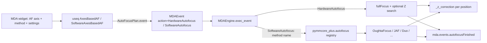

# Autofocus plan: software routines and hardware Z search

<!-- markdownlint-disable MD013 -->

Goal: port the software autofocus routines that Micro-Manager's MMStudio ships
(`micro-manager/autofocus`) to Python, and make them runnable both on demand and
inside an MDA, the same way hardware autofocus runs today: the user picks the
axes on which autofocus fires (`p`, `t`, `g`, …), useq inserts autofocus events,
and the pymmcore-plus engine executes them.

Alongside that, two smaller changes to *hardware* autofocus come out of
reading the Java code: a Z search when the hardware autofocus cannot lock (MM's
`HardwareFocusExtender`), and an "every N time points" option (MM's "skip
frames"). Both kinds of autofocus also get one result signal.

The MDA widget's autofocus section is in scope (§6). It gets mutually
exclusive **Hardware** / **Software** checkboxes that share one "autofocus
axis" selector and the per-position override. The method picker, the settings
form, a "focus now" button and a focus-curve view are left to a separate GUI
plan, and every choice here assumes them.

| Repo | Change |
| --- | --- |
| `useq-schema` (`cite`) | A generic `SoftwareAutofocus` action that names no specific routine; a software variant of the axes-based plan; Z search fields on `HardwareAutofocus`; an `every_n_timepoints` trigger option |
| `pymmcore-plus` (`cite`) | New `pymmcore_plus.autofocus` package with the ported routines and their names; the engine runs `SoftwareAutofocus` events; hardware Z search; an `autofocusFinished` signal for both kinds |
| `pymmcore-widgets` (`cite`) | The autofocus section gets mutually exclusive Hardware / Software checkboxes, plus search above/below/step for hardware |
| `pymmcore-gui` | Nothing in this plan. Pixel calibration stays in `_pixel_calibration/` (see §8). The software autofocus GUI gets its own plan later. |

---

## 1. How MMStudio does it

### 1.1 Autofocus in the MDA

- `DefaultAutofocusManager.refresh()` builds one list of *methods*: each loaded
  hardware autofocus device, wrapped as `CoreAutofocus`, whose `fullFocus()` is
  `core.fullFocus()`, followed by every software plugin. Exactly one method is
  *current*.
- With the MDA "Autofocus" box checked, `AcqEngJAdapter.autofocusHook` calls
  `getAutofocusMethod().fullFocus()` before channel 0 / z 0 of every (time point,
  position). It is skipped when `t % skipAutofocusCount != 0`.
- After autofocus, the Z of every 1-D stage is stored under the position's
  name (`positionMap_`). `adjustZDrivesHook` then rewrites the stage
  coordinates of later events at that position. This is the same idea as our
  `_z_correction`.
- Continuous focus (a PFS lock) is a separate mechanism. It stays engaged
  during the run. An optional setting unlocks it for each Z stack and locks it
  again afterwards (`continuousFocusHookBefore/After`).
- Hardware and software autofocus together only happens through `Duo` (method
  A then B) or the special plugins (`HardwareFocusExtender`,
  `PFSOffsetFocusser`).

**Consequence for us:** one autofocus plan per (sub)sequence, which is what
useq has today. A software plan replaces the hardware plan; it is never added
next to it. `Duo` covers chaining.

### 1.2 The plugins

Each one implements `AutofocusPlugin`: `fullFocus()` returns the best Z, there
is a string property bag, and `computeScore(ImageProcessor)` scores an image.

| MM name | Java class | What it does | Settings | Here |
| --- | --- | --- | --- | --- |
| **OughtaFocus** | `OughtaFocus.java` + `optimizers/BrentFocusOptimizer.java` + `optimizers/ZStackFocusOptimizer.java` | The main method. Optionally switches channel, exposure and a centred crop, and can hold the shutter open. Then it runs the Brent or Z-stack optimizer on a score from `ImgSharpnessAnalysis` and moves the drive to the result. | `OptimizerStrategy` {Brent, Z-Stack}, `FocusDrive` (any Stage; empty = core focus device), `SearchRange_um` (10), `Tolerance_um` (1), `CropFactor` (1, clipped 0.01–1), `Channel`, `Exposure` (100), `Maximize` (scoring; Edges), `FFTLowerCutoff(%)` (2.5), `FFTUpperCutoff(%)` (14), `ShowImages`, `ShowGraph`, `KeepShutterOpen` | software port |
| **JAF(H&P)** | `Autofocus.java` | A coarse linear scan, then a fine one, on the core focus device. Each pass stops early once the score drops by more than `Threshold × best`. Score: 3×3 median, a single diagonal 3×3 kernel, then the sum of squares over a centred crop. | `1st step size` (2), `1st step number` (1 → ±1), `2nd step size` (0.2), `2nd step number` (5), `Threshold` (0.02), `Crop ratio` (0.2), `Channel` | software port |
| **JAF(TB)** | `AutofocusTB.java` | Same two-pass scan, but the coarse pass is in `Channel-1` and the fine pass is in `Channel-2`. Score: crop, 3×3 median, ImageJ `findEdges`, then the sum. | as H&P, with `Channel-1`/`Channel-2` | software port |
| **Duo** | `AutofocusDuo.java` | Runs two other methods in sequence. | `AutoFocus-1`, `AutoFocus-2` | software port |
| **PFSOffsetFocusser** | `PFSOffsetFocusser.java` | Runs a software autofocus on the Z drive and re-engages the PFS. It then iterates the PFS offset until the Z drive is within `Precision` of the software result. The offset→Z "gearing" is learned per pixel-size config and stored in the profile. | `SoftwareFocusMethod`, `ZDrive`, `PFS`, `Precision` (2) | software port, last |
| **HardwareFocusExtender** | `HardwareFocusExtender.java` | Uses no images. It tries `core.fullFocus()`; if that fails, it steps the Z drive down to `Lower limit`, then up to `Upper limit`, until a full focus locks. | `HardwareFocusDevice`, `ZDrive`, `StepSize` (5), `Lower limit` (300), `Upper limit` (100) | **not ported as a method:** becomes Z search on `HardwareAutofocus` (§4) |

Scoring methods in `libraries/ImageProcessing/.../ImgSharpnessAnalysis.java`:
`Edges`, `StdDev`, `Mean`, `NormalizedVariance`, `SharpEdges`, `Redondo`,
`Volath`, `Volath5`, `MedianEdges`, `Tenengrad`, `FFTBandpass`.
`FFTBandpass` uses `FHTNoscaling.java`. It pads the image to a square power of
two, takes a log power spectrum quantised to 8 bits, and returns the mean
inside an annulus.

The Z-stack optimizer fits `curvefit/GaussianWithOffsetCurveFitter`
(parameters norm, mean, sigma, offset) and clamps the fitted mean to the
scanned range (`Fitter.getXofMaxY`). When the drive supports sequencing, it
acquires the stack with `loadStageSequence` and `startSequenceAcquisition`.

### 1.3 Java behaviour to decide on, not copy blindly

The policy is the one the pixel-calibration port used: reproduce Java, and mark
every departure in brackets in the architecture doc.

- **ZStack start point.** Java passes a 2-element guess `{z, score_mid}` to a
  4-parameter fitter whose documented order is norm, mean, sigma, offset. It
  looks wrong, so check what commons-math does with it before deciding.
  Proposal: use the `ParameterGuesser` estimate.
- **ZStack positions.** `nrZ = (int)(range / step)` leaves out the upper end,
  so the scan is asymmetric. The first `core.setPosition(z - dz)` also moves the
  *default* focus device instead of `zDrive_`. Proposal: fix both and mark
  them.
- **Redondo.** Its "centre" term is `(i - 1, j)`. The Java comment says this
  copies the paper on purpose. Proposal: keep it.
- **Tenengrad.** The in-place flag is inverted, so the input is mutated. The
  score is not affected, and the NumPy port has no such side effect.
- **Integer rounding and clipping are not part of the algorithm.** The Java code
  writes every intermediate result back into an 8- or 16-bit image, so it is rounded
  and clipped to the pixel range: a gradient kernel keeps only the responses of one
  sign and throws the rest away. The port works in `float64` throughout. A focus
  score is only ever compared with other scores of the same image stack, so what
  matters is where its maximum lies, not its value -- and keeping the gradient
  information makes the metric better behaved, not worse.
- **The median filter is applied at every pixel depth.** In Java it silently does
  nothing on 16-bit images (`ShortProcessor.medianFilter()` is a no-op, in every
  ImageJ version checked), so on a 16-bit camera -- most scientific cameras --
  `MedianEdges`, `JAF(H&P)` and `JAF(TB)` run on the raw, noisy image rather than the
  denoised one their descriptions promise. The port always applies the 3x3 median,
  since suppressing single-pixel noise is the whole reason that step exists in an
  edge-based score.
- **Borders.** Every filter repeats the edge pixel, so the output is the same shape as
  the input and border pixels are filtered like any other. (Java is inconsistent
  here: its convolutions repeat the edge pixel, while its 8-bit median leaves a
  border of zeros.)
- **JAF return values.** JAF `fullFocus()` returns `0` instead of the Z it
  found, uses a `5000` sentinel, and busy-waits. The port returns the real Z
  and uses `time.sleep` for the settle time.
- **JAF(H&P) channel group.** The group is only set inside `getProperties()`.
  The port uses the core channel group, or an explicit group.

---

## 2. End-to-end design



Decisions:

1. **useq has no list of routine names.** `SoftwareAutofocus.method` is a plain
   `str`. The names, the settings models and their validation live in
   `pymmcore_plus.autofocus`, next to the code that runs them, so names never
   have to be kept in sync across two repos. useq only guarantees that the
   action carries a name and JSON-serialisable settings. Any other engine is
   free to interpret them its own way.
2. **The algorithms live in `pymmcore-plus` (`cite`),** in a new
   `pymmcore_plus.autofocus` subpackage. The engine has to run them, and a
   saved sequence that uses software autofocus has to run from a plain script
   with no GUI installed. The port needs only NumPy and the core. Keeping it in
   its own subpackage, with a single hook in `_engine.py`, keeps rebasing `cite`
   onto upstream cheap.
3. **The engine owns *when* and the bookkeeping; the routine owns *how*.** The
   engine handles sequencing, retries, the Z correction, continuous focus,
   cancellation and the result signal. The routine snaps, scores, moves the
   drive, and restores the capture state.
4. **The action carries the full settings snapshot,** so a saved sequence
   reproduces exactly. MMStudio keeps these settings in the user profile.

---

## 3. useq-schema

### 3.1 `SoftwareAutofocus` action (`src/useq/_actions.py`)

```python
class SoftwareAutofocus(Action):
    """[`useq.Action`][] to perform an image-based (software) autofocus.

    useq does not define which methods exist: `method` and `settings` are
    interpreted by the acquisition engine (for pymmcore-plus, see
    `pymmcore_plus.autofocus`).

    Attributes
    ----------
    type : Literal["software_autofocus"]
    method : str
        Name of the autofocus routine, as known to the acquisition engine.
    focus_device : str | None
        Stage device the routine moves. `None` means the engine's default
        focus device.
    settings : dict
        Routine-specific settings. Must be JSON serializable.
    max_retries : int
        Attempts if the routine raises. By default, 1 (no retry).
    """

    type: Literal["software_autofocus"] = "software_autofocus"
    method: str
    focus_device: str | None = None
    settings: dict = Field(default_factory=dict)
    max_retries: int = 1
```

- Move `CustomAction._ensure_serializable` into a shared validator and use it
  for both actions.
- `AnyAction = HardwareAutofocus | SoftwareAutofocus | AcquireImage | CustomAction`.
  `MDAEvent.action` already discriminates on `type`, so this is
  backward-compatible.
- Export it from `useq/__init__.py`.

### 3.2 Z search on `HardwareAutofocus`

```python
class HardwareAutofocus(Action):
    ...
    max_retries: int = 3
    search_below_um: float = 0.0
    search_above_um: float = 0.0
    search_step_um: float = 5.0
```

- The same three fields go on `AutoFocusPlan`, and `as_action()` passes them
  through. That also covers `max_retries`, which `as_action()` does not pass
  today.
- Validation: all three are ≥ 0, and `search_step_um > 0` whenever either range
  is > 0.
- **Schema default 0, widget default 10 µm.** With 0 in the schema, existing
  sequences and scripts keep their behaviour and never start moving Z on their
  own. The MDA widget fills in 10 µm above and below (§6), so every new GUI
  run gets the search.
- `search_step_um` defaults to 5 µm, MM's value. With ±10 µm that is two tries
  on each side. Lower it if the hardware autofocus lock range is narrow.

### 3.3 Software plan and "every N time points"

Autofocus plans are split across four small modules, so that software plans do not
live in a file named `_hardware_autofocus.py`:

| Module | Holds |
| --- | --- |
| `_autofocus_base.py` | `_AutofocusPlanBase` (the shared `event()`), `_AxesTrigger` (the shared axis/time trigger) |
| `_hardware_autofocus.py` | `AutoFocusPlan`, `AxesBasedAF` |
| `_software_autofocus.py` | `SoftwareAutofocusPlan`, `SoftwareAxesBasedAF` |
| `_autofocus.py` | `AnyAutofocusPlan` and its discriminator (needs both concrete modules, so it must come last) |

Split the trigger from the action:

```python
class _AxesTrigger(FrozenModel):
    axes: tuple[str, ...]
    every_n_timepoints: int = 1   # MM's "skip frames"; 1 = every time point
    _previous: dict = PrivateAttr(default_factory=dict)

    def should_autofocus(self, event) -> bool:
        # existing "any axis changed" rule; then, if "t" in event.index and
        # event.index["t"] % every_n_timepoints != 0, return False.
        # _previous is updated before the early return.

class AxesBasedAF(_AxesTrigger, AutoFocusPlan): ...            # hardware (unchanged API)

class SoftwareAxesBasedAF(_AxesTrigger, _SoftwareAFPlan):
    method: str
    focus_device: str | None = None
    settings: dict = Field(default_factory=dict)
    max_retries: int = 1
    def as_action(self) -> SoftwareAutofocus: ...
```

- Both plans need `AutoFocusPlan.event`, which rewrites a relative z plan to
  the home position, so it moves to a shared base.
- `every_n_timepoints` follows MM: when `t % N != 0`, autofocus is skipped
  whichever axis triggered it. It sits on the trigger, so it works for both
  plans.
- The absolute-Z-plan check in `MDASequence` and the v2
  `AutoFocusTransform` both use `isinstance(..., AxesBasedAF)`. The first becomes
  `_AutofocusPlanBase` ("is an autofocus plan at all"), the second `_AxesTrigger`
  ("has axes"). The v2 transform also has to apply `every_n_timepoints`.
- `AnyAutofocusPlan` annotates a pydantic field, so it must be imported at runtime
  with `# noqa: TC001`, as `AnyZPlan` and `AnyTimePlan` already are. Ruff's
  flake8-type-checking fix moves it into `TYPE_CHECKING` otherwise.
- **Union discrimination.** `FrozenModel` uses `extra="ignore"`, so a plain
  union could parse a software plan as `AxesBasedAF` and silently drop
  `method`. Use a callable `Discriminator` that picks the software plan when
  `method` is present. Old JSON keeps parsing as `AxesBasedAF`.
  `AnyAutofocusPlan = Annotated[AxesBasedAF | SoftwareAxesBasedAF, Discriminator(...)]`.
- Per-position override already works through
  `active_sequence.autofocus_plan or sequence.autofocus_plan` in
  `_iter_sequence.py`.

### 3.4 Tests

- JSON and YAML round-trips for both plans and both actions.
- Old hardware-plan JSON still parses.
- Event insertion on the chosen axes, with `every_n_timepoints`, in both v1 and
  v2.
- The relative-Z home position, and absolute-Z rejection for both plans.
- Validation of the search fields.

---

## 4. pymmcore-plus: hardware Z search (`mda/_engine.py`)

This extends `_execute_autofocus`, which today calls `fullFocus()` with
`@retry` at the same Z, and so cannot recover when focus is out of the
hardware's lock range.

1. Same as today: switch continuous focus off, apply
   `autofocus_motor_offset`, and record `z0 = core.getZPosition()`.
2. Try `fullFocus()` at `z0`, with `max_retries`.
3. If it still fails and a search range is set, step the core focus device
   down to `z0 - search_below_um`, then up to `z0 + search_above_um`, in steps
   of `search_step_um`. At each step: `setZPosition`, `waitForDevice`, then one
   `fullFocus()` attempt. Stop at the first lock. This is MM's order. "Below"
   means lower Z values, whatever the device's physical direction.
4. On a lock, the correction is `getZPosition() - z0`. The search move is part
   of the delta, which is correct because the lock is where the focus actually
   is.
5. If nothing locks, move back to `z0` and raise. `exec_event` logs the warning
   and sets `_af_succeeded = False`, as it does today.
6. MM special-cases the Nikon TI "Out of focus search range" status. That is
   not ported: a generic retry covers it.

Tests (demo config): put the demo autofocus into a state where it fails, and
check that it succeeds after N steps. Also check the search order, the
range limit, the return to `z0` on failure, the correction, and that
defaults of 0 change nothing.

---

## 5. pymmcore-plus: software autofocus

### 5.1 Package `src/pymmcore_plus/autofocus/`

```text
autofocus/
  __init__.py      # public API, built-in method names, register_software_autofocus
  _names.py        # SoftwareAFMethod(StrEnum): OUGHTAFOCUS="oughtafocus", JAF_HP="jaf_hp",
                   # JAF_TB="jaf_tb", DUO="duo", PFS_OFFSET="pfs_offset"; display names ("OughtaFocus", "JAF(H&P)", …)
  _settings.py     # one pydantic settings model per method (pydantic comes with useq)
  _filters.py      # convolve3x3, sobel_magnitude, sharpen, median_3x3 (float64)
  _scoring.py      # ScoringMethod: the 11 sharpness methods, plus jaf_score
  _fft.py          # log power spectrum + mean power in a frequency band
  _optimizers.py   # brent_search, zstack_search, fit_peak, FocusSearchResult
  _capture.py      # channel / exposure / crop-ROI / shutter: apply and restore
  _routines.py     # oughtafocus, jaf_hp, jaf_tb, duo, pfs_offset
  _registry.py     # name -> SoftwareAutofocusMethod; built-ins pre-registered
```

`SoftwareAFMethod` is a `StrEnum`, so `SoftwareAutofocus(method=SoftwareAFMethod.OUGHTAFOCUS)`
and `method="oughtafocus"` mean the same thing. The JSON stays a plain string.
Widgets list `available_methods()` and never hardcode names.

### 5.2 Public API

```python
@dataclass
class AutofocusResult:                       # shared with hardware AF (§5.4)
    kind: Literal["hardware", "software"]
    method: str                              # software method name, or AF device label
    focus_device: str
    z_before: float
    z_after: float
    succeeded: bool
    message: str = ""
    scores: list[tuple[float, float]] = field(default_factory=list)   # (z, score)
    n_images: int = 0

class SoftwareAutofocusMethod(Protocol):
    def __call__(self, core: CMMCorePlus, action: SoftwareAutofocus, *,
                 should_cancel: Callable[[], bool]) -> AutofocusResult: ...

run_software_autofocus(core, method, settings=None, *, focus_device=None,
                       should_cancel=lambda: False,
                       on_sample: Callable[[float, float, np.ndarray], None] | None = None,
                       ) -> AutofocusResult
score_image(image: np.ndarray, method: ScoringMethod, **opts) -> float
available_methods() -> list[str]
settings_model(method: str) -> type[BaseModel]       # drives a settings form
register_software_autofocus(name: str, fn: SoftwareAutofocusMethod) -> None   # custom methods
```

- The "focus now" button and the MDA both go through
  `run_software_autofocus`, so there is a single code path.
- `on_sample` is the hook for a live focus-curve plot, which MM calls
  `ShowGraph`. It runs on the worker thread.

### 5.3 Settings models

The names follow Python conventions, not MM's property strings. A
`JAVA_PROPERTY_NAMES` map keeps the correspondence for the docs.

| Method | Fields (default) |
| --- | --- |
| `oughtafocus` | `optimizer` {"brent", "zstack"} ("brent"), `search_range_um` (10), `tolerance_um` (1; also the Z-stack step), `crop_factor` (1, 0.01–1), `channel_group`/`channel` (None = unchanged), `exposure_ms` (None = unchanged), `scoring` (Edges), `fft_lower_pct` (2.5), `fft_upper_pct` (14), `keep_shutter_open` (False), `show_images` (False) |
| `jaf_hp` | `coarse_step_um` (2), `coarse_steps` (1), `fine_step_um` (0.2), `fine_steps` (5), `threshold` (0.02), `crop_ratio` (0.2), `channel` (None), `settle_s` (0.3 / 0.1 as Java) |
| `jaf_tb` | as `jaf_hp`, plus `coarse_channel` and `fine_channel` |
| `duo` | `first`, `second`: each a nested `{method, settings}` |
| `pfs_offset` | `software_method` (+ settings), `pfs_device`, `precision_um` (2), `gearing` (None = learn) |

- `exposure_ms=None` means "keep the current exposure", which suits an MDA
  where the channel has already set it. Java OughtaFocus always sets an
  exposure (default 100 ms). [Python only]
- `pfs_offset`: pymmcore-plus has no user profile. The learned gearing is
  cached per engine and per pixel-size config, and returned in the result's
  `message`/metadata so the GUI can persist it and pass it back as `gearing`.
  [Different from Java]

### 5.4 Engine (`mda/_engine.py`)

A branch in `exec_event`, next to `HardwareAutofocus`:

```python
if isinstance(action, SoftwareAutofocus):
    self._exec_software_autofocus(event, action)
    return
```

`_exec_software_autofocus`:

1. Resolve `action.method` in the registry: the built-ins plus anything
   registered. If it is unknown, log a warning and return, mirroring
   "No autofocus device found".
2. Resolve the drive: `action.focus_device or core.getFocusDevice()`. If there
   is none, warn and return.
3. **Continuous focus.** If it is locked, switch it off. Do *not* set
   `_af_needs_reengage`, because re-engaging would pull the focus away from the
   software result. Methods that manage the hardware autofocus themselves
   (`pfs_offset`) set `manages_continuous_focus = True`, and the engine skips
   this step for them.
4. Record `z0` on the drive and run the method, retrying up to `max_retries`
   if it raises.
5. On success, if `drive == core.getFocusDevice()`, add `result.z_after - z0`
   to `self._z_correction[p_idx]`, the same bookkeeping as hardware
   autofocus. For any other drive (for example a piezo while the z plan uses
   the main drive), no correction is stored and the drive stays where the
   routine left it.
6. On failure, log a warning, keep the old correction, and make sure the drive
   is back at `z0`.
7. Emit `autofocusFinished` (§5.5).

Already handled, no change needed:

- `setup_event` moves to the autofocus event's `z_pos`, which
  `AutoFocusPlan.event` rewrote to the home position.
- `_sequencing.can_extend_event_batch` never merges anything that is not
  `AcquireImage`.
- `_z_correction` is cleared in `setup_sequence`.

Inside an MDA, the routine must also respect the following.

- **Cancel.** `should_cancel` is built from the runner's state (the smart
  engine reads `runner.status.phase`; confirm the accessor). The routine
  checks it between moves.
- **Images.** The routine uses `snapImage`/`getImage`. Its images never reach
  `frameReady` or the dataset. `CMMCorePlus.snapImage` emits `imageSnapped`,
  so the preview shows the autofocus frames, which is MM's `ShowImages`.
  `show_images=False` calls the base `pymmcore.CMMCore.snapImage(core)` to
  stay quiet.
- **State restore.** Channel, exposure, ROI and shutter must be restored
  before returning. The next acquisition event only re-applies the channel if
  `(group, config) != core._last_config`, so use the `CMMCorePlus.setConfig`
  override, which keeps `_last_config` in sync.
- **Safety.** `max_travel_um` refuses any target further than this from `z0`.
  It defaults to the method's search range plus a margin.

### 5.5 `autofocusFinished` signal, for both kinds

- Add `autofocusFinished: ClassVar[PSignal]` to `PMDASignaler`
  (`mda/events/_protocol.py`), as `Signal(object, object)` in `_psygnal.py`
  and `_qsignals.py`. The arguments are `(event: MDAEvent, result:
  AutofocusResult)`.
- The engine emits it through `self.mmcore.mda.events` after every
  autofocus event: hardware (with `scores` empty), and software. It is emitted
  for both success and failure.
- What this makes possible in the GUI: a status line, a per-position autofocus
  log, a focus-curve view, and writing autofocus results into the dataset
  metadata later. The Z each frame was taken at is already in the frame
  metadata, so the corrected focus is recorded even without the signal.
- What is required, and covered even without a listener: failures are never
  silent. Both paths log a warning with the method, the position, and the Z
  before and after.

### 5.6 Port order

1. `_filters.py` and `_scoring.py`. **`_filters.py` is done**: `convolve3x3`,
   `sobel_magnitude`, `sharpen` and `median_3x3`, in `float64`, accepting any numeric
   pixel type. Its tests state the properties a focus score depends on (a normalized
   kernel leaves a flat image alone, a gradient kernel stays signed, the median kills a
   hot pixel but keeps a real edge) rather than comparing against Java. While porting,
   cross-check the numbers against the Java implementation to catch mistakes; do not
   commit that comparison.
2. `_fft.py`. **Done**: `log_power_spectrum` and `bandpass_power` (an annulus mean
   of the log power spectrum, in float -- Java quantises it to 8 bits first).
   **`_scoring.py` is done too**: all 11 methods plus `jaf_score`, with tests that
   assert the property that actually matters -- every method peaks on the in-focus
   image and falls off monotonically either side, on a textured sample.
   Two things that surfaced while testing, both now documented and covered:
     - `MEDIAN_EDGES` is blind to detail one pixel across (the median removes it), so
       a sample of isolated points scores zero however sharp it is. Not a good default.
     - `MEAN` is not a sharpness measure at all; it only tracks focus where focus
       changes brightness, as in brightfield.
3. `_optimizers.py`. **Done**: `brent_search` (fewest images, needs a single peak)
   and `zstack_search` (fixed cost, sees the whole curve, survives noise), both taking
   a `measure(z) -> score` callable so they test without hardware. `fit_peak` locates
   the peak between samples by fitting a parabola in log space (equivalently, a
   Gaussian) to the three points around the best one, falling back to the best sample
   at a scan edge or a degenerate fit. A separate `_fit.py` turned out not to be
   needed: the closed-form three-point fit removes any need for an iterative
   Gaussian fit, so there is no dependency on `scipy`. `FocusSearchResult` carries
   every `(z, score)` measured, which is what a focus-curve view will plot.
4. `_capture.py`. **Done**: a `capture_state` context manager for the channel,
   exposure, centred crop and shutter, restoring every one exactly once -- and rolling
   back if *applying* fails partway, which a first draft got wrong.
5. **Done**: `oughtafocus` (both searches), `jaf` (the two-pass coarse/fine scan,
   covering both JAF plugins via an optional second channel), and `duo`, plus the
   `_registry.py` that turns a name from a `useq.SoftwareAutofocus` action into
   something that runs, and `run_software_autofocus` as the single entry point for
   both the MDA and a future "focus now" button. **The engine branch is wired too**
   (§5.4): retries, the Z correction, continuous-focus handling, cancellation and the
   `autofocusFinished` signal.
6. `pfs_offset`. Last, because it needs hardware to test.

### 5.7 Tests

- **Scoring:** every method against the Java reference values; monotonic
  scores on a synthetic blur series (Gaussian σ 0…5); the dtype-clipping
  cases.
- **Routines:** on the demo core, with a camera whose blur depends on
  `|z - z_focus|` (a patched `getImage` or the UniCore simulate backend). Each
  method must recover `z_focus` within its tolerance. Also test early stop,
  the crop, channel and exposure restore, cancel, `max_travel_um`, and the
  hardware-sequenced Z-stack (the demo Z stage supports sequencing).
- **Engine:** the method runs on the right axes and with
  `every_n_timepoints`; the correction applies to the next z-stack; no
  correction for a non-default drive; unknown methods are skipped; retries;
  continuous focus is switched off; the signal is emitted for both kinds;
  sequenced acquisitions split around autofocus events.
- **End to end:** `SoftwareAxesBasedAF(axes=("p",), method="oughtafocus")` on
  two positions with different focal planes yields correctly centred
  z-stacks.

### 5.8 Docs

- A user guide page, `docs/guides/autofocus.md`.
- Developer notes in `autofocus/README.md`, in the style of
  `smart/README.md` and the GUI's `PIXEL_CALIBRATION.md`: each routine's
  algorithm, bracketed `[Python only]` / `[Different from Java]` notes for every
  item in §1.3, the option tables, and a source map.

---

## 6. pymmcore-widgets: the MDA autofocus section

### 6.1 Hardware or software: mutually exclusive checkboxes

The current autofocus section in `useq_widgets/_mda_sequence.py` holds the
`AutofocusAxis` selector. It gains two checkboxes, **Hardware autofocus** and
**Software autofocus**. At most one can be checked at a time, matching one
autofocus plan per sequence (§1.1).

- **Exclusion.** Checking one unchecks the other. Unchecking the checked one
  leaves both unchecked, which means no autofocus. A plain exclusive
  `QButtonGroup` doesn't allow unchecking the checked box, so either toggle
  `setExclusive(False)` around the uncheck or handle `toggled` by hand.
- **Shared and per-kind controls.** The axis selector and "every N time
  points" are shared by both kinds. Under **Hardware**: search below, search
  above and step (§6.2). Under **Software**: the method picker and the
  settings form generated from `settings_model(method)` (step 7). Only the
  checked kind's controls are shown or enabled.
- **Building the value.** Neither box checked, or no axis selected: no
  `autofocus_plan`. Hardware checked: `AxesBasedAF(...)`. Software checked:
  `SoftwareAxesBasedAF(method=..., settings=...)`. `setValue` checks the box
  that matches the plan type it receives.
- **When each box is enabled.** Hardware: only when an autofocus device is
  loaded, using the existing `_update_autofocus_enablement` logic and
  tooltips. Software: only when a focus device is loaded and at least one
  method is registered. With a relative-Z requirement, both are disabled for
  an absolute z plan, as today.
- **Per-position autofocus.** `stage_positions.af_per_position`
  (`mda/_core_positions.py`) builds per-position sub-sequence plans. These use
  the same kind as the global checkbox. Switching kind rebuilds them, so a
  sequence never mixes hardware and software plans.
- **Pre-run checks** (`mda/_core_mda.py`). The existing "the autofocus device
  is engaged but no autofocus axis is selected" dialog applies when
  **Hardware** is checked. When **Software** is checked and continuous focus
  is locked, warn that it will be switched off for the run (§5.4, step 3).
- **Until the software port lands (step 7),** the **Software** checkbox is
  hidden. The section looks as it does today, plus the hardware search fields.

### 6.2 Hardware Z search fields

- Under **Hardware**, add "Search below" and "Search above" spin boxes
  (default 10 µm) and "Step" (default 5 µm). They are enabled only when an
  axis is selected. They are written into
  `AxesBasedAF(axes=..., search_below_um=..., ...)` and read back in
  `setValue`. The schema default stays at 0 (§3.2). The 10 µm is a widget
  default only, so sequences built in code keep the old behaviour.
- An "every N time points" spin box (default 1) sits next to the axis
  selector, shared by both kinds.
- `mda/_core_mda.py`: the `autofocus_motor_offset` fill-in at about line 309
  already uses `afplan.replace(...)`, which keeps the new fields. It must only
  run for `AxesBasedAF`, not for the software plan.
- Check `mda/_collapsible_mda.py` and `mda/_topbar_mda.py`, which persist and
  restore "global settings (… autofocus axis)". Add the selected kind and the
  new fields there.

### 6.3 Tests

- A round trip through `MDASequenceWidget` for no autofocus, a hardware plan
  and a software plan.
- Checking one box unchecks the other; unchecking leaves no plan.
- The hardware default produces 10 µm search ranges.
- Enablement with and without an autofocus device or focus device.
- Per-position plans follow the selected kind.

---

## 7. Rollout

| Step | Repo | Content | Depends on |
| --- | --- | --- | --- |
| 1 | useq-schema | **Done.** `SoftwareAutofocus`, trigger refactor + `every_n_timepoints`, `SoftwareAxesBasedAF`, discriminated plan union, `HardwareAutofocus` search fields, tests | none |
| 2 | pymmcore-plus | **Done.** Hardware Z search, `AutofocusResult`, `autofocusFinished` signal for hardware autofocus | 1 |
| 3 | pymmcore-widgets | **Done.** Checkable Autofocus group, Hardware/Software radio buttons, hardware search fields, software every-N | 1, 2 |
| 4 | pymmcore-plus | **Done.** `autofocus/` filters, scoring, FFT band, optimizers | none |
| 5 | pymmcore-plus | **Done.** Optimizers, capture, `oughtafocus`, `jaf`, `duo`, engine branch, registry | 1, 2, 4 |
| 6 | pymmcore-plus | `pfs_offset` | 5 |
| 7 | pymmcore-widgets / gui | Method picker + settings form in the MDA autofocus section; "focus now" panel and focus-curve view (separate plan) | 3, 5 |

Steps 1–3 deliver the hardware Z search on their own, without waiting for the
software port. Use the usual editable install with `uv run --no-sync` while
developing across repos.

---

## 8. Not in this plan

- **Moving pixel calibration to pymmcore-plus.** Not needed: the engine never
  runs it, and only the GUI panel calls it. It is already Qt-free (NumPy only),
  so it can move later if scripts need it. If it moves, it goes to its own
  subpackage, without sharing a capture-state class with `autofocus/`.
- **Hardware and software autofocus as two plans in one sequence.** MM doesn't
  do it either (§1.1). `duo` covers chaining.
- **Unlocking continuous focus during Z stacks**, MM's
  `getUnlockAutofocusDuringZStack`. This is a separate engine feature.
- **Float (unclipped) scoring variants.** They can be added later as extra
  `ScoringMethod` members, without breaking the faithful ones.
