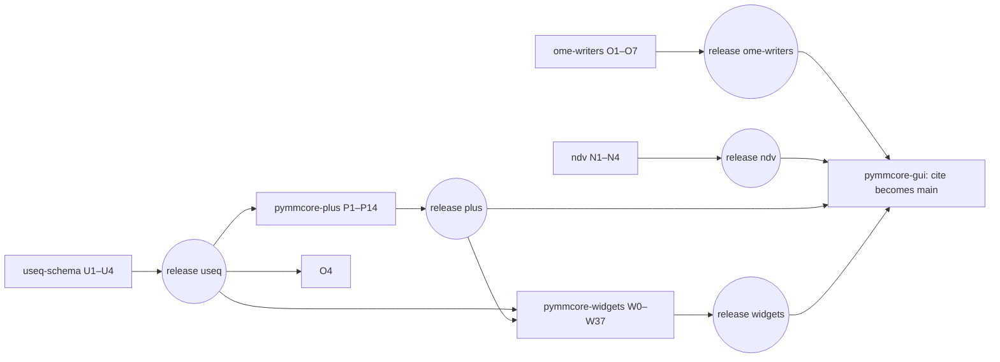

<!-- markdownlint-disable MD013 -->
# Upstreaming the `cite` work: PR plan

This plan upstreams the work on the `cite` branches. It is written for an agent
to follow step by step. A human (fdrgsp) reviews and approves at the marked
**STOP** points.

- **The five libraries** pinned by pymmcore-gui (useq-schema, ome-writers,
  ndv, pymmcore-plus, pymmcore-widgets) are split into small PRs against each
  upstream `main` (§3–§7).
- **pymmcore-gui is not split.** The current upstream `main` is kept as a
  copy, and the cleaned-up `cite` becomes the new `main` (§8). This happens
  once the libraries it needs are released.

Survey date: 2026-10-08. All SHAs below were current then. Section 0.2
re-checks them before work starts.

---

## 0. Ground rules

### 0.1 Repos, sources and targets

| Repo | Local clone | Fork remote (`origin`) | Upstream remote (`upstream`) | Source ref (pinned in gui `uv.lock`) | Upstream `main` at survey |
| --- | --- | --- | --- | --- | --- |
| useq-schema | `~/Documents/git/useq-schema` | fdrgsp/useq-schema | pymmcore-plus/useq-schema | `origin/cite` = `a59f64a` | `8e44aa2` (v0.9.2) |
| ome-writers | `~/Documents/git/ome-writers` | fdrgsp/ome-writers | pymmcore-plus/ome-writers | `origin/cite` = `69d110c` | `ba0f638` (v0.3.2) |
| ndv | `~/Documents/git/ndv` | fdrgsp/ndv | pyapp-kit/ndv | `origin/cite` = `11b1f9d` | `f30ec34` (v0.5.0) |
| pymmcore-plus | `~/Documents/git/pymmcore-plus` | fdrgsp/pymmcore-plus | pymmcore-plus/pymmcore-plus | `origin/cite` = `a2081c3` | `f8884a6` (v0.18.1) |
| pymmcore-widgets | `~/Documents/git/pymmcore-widgets` | fdrgsp/pymmcore-widgets | pymmcore-plus/pymmcore-widgets | `origin/cite` = `318abbd` | `d61a158` (v0.12.1) |
| pymmcore-gui | `~/Documents/git/pymmcore-gui` | fdrgsp/pymmcore-gui | pymmcore-plus/pymmcore-gui | `cite` = `d949196` | `2634ee6` |

Facts the plan relies on:

- Every library fork's `origin/cite` already contains its upstream `main`
  (merge-base = upstream `main`), so library PRs apply cleanly to `main`.
- **pymmcore-gui `cite` is 14 commits behind upstream `main`**, and merging
  conflicts in 10 files. Phase 0 (§2.3) merges `main` into it, so the new
  `main` contains the old one and loses none of its fixes.
- **The local library clones are behind their forks.** Local `cite` in
  useq-schema, pymmcore-plus and ome-writers is older than `origin/cite`.
  pymmcore-plus is checked out on `fix/docs-snippet-directives` and ndv on
  `ngff-zarr-wrapper`. Always use `origin/cite`, never a local branch, and
  never touch the user's checkouts: work in worktrees (§0.4).
- The pymmcore-widgets clone has no `upstream` remote yet. Add it with
  `git remote add upstream https://github.com/pymmcore-plus/pymmcore-widgets.git`
  if it is still missing.

### 0.2 Freeze the sources (do this first)

`cite` keeps moving: `d949196` landed while this plan was being written. Tag
what you split, so every PR is cut from the same snapshot:

```bash
for r in useq-schema ome-writers ndv pymmcore-plus pymmcore-widgets; do
  git -C ~/Documents/git/$r fetch origin && git -C ~/Documents/git/$r fetch upstream
  git -C ~/Documents/git/$r tag -f split/src origin/cite
  git -C ~/Documents/git/$r tag -f split/base upstream/main
done
# pymmcore-gui: nothing to tag yet; §2.3 and §8 work from `cite` directly
```

Check that the SHAs the GUI `uv.lock` pins still match each library's
`split/src`:

```bash
grep -oE 'fdrgsp/[a-z-]+\?rev=cite#[0-9a-f]{40}' ~/Documents/git/pymmcore-gui/uv.lock
```

If a fork moved since the survey, re-read its new commits (`git log
<survey-sha>..split/src`) and slot them into the PR lists below before
continuing. If that isn't obvious, **STOP** and ask.

### 0.3 Global exclusions (never upstream these)

| What | Where | Why |
| --- | --- | --- |
| `pymmcore_plus.smart` (smart microscopy API), with its docs, examples, tests, `CMMCorePlus.run_smart`, and the `writeable` typos entry | pymmcore-plus commits `23925f7`, `2246037`, `c3881d1`, `209c24f`, `7fcb12a`, `a937a7d`, `e103d85` | Out of scope, by request. |
| `OmeWritersSink.stores_events` / `frame_meta_to_ome(include_event=...)` | the `_sink.py` hunk of `23925f7` | Only smart runs need it. Optional follow-up, see §4.6. |
| Python 3.10 compatibility fixes | pymmcore-plus `a1b89b9` | Upstream already requires `>=3.11`. |
| `[tool.uv.sources]` entries pointing at `fdrgsp/*@cite` | pyproject of plus, widgets, gui | Fork pins. PRs depend on released versions (§0.6). |
| `pymmcore-plus @ git+https://github.com/fdrgsp/...` in `.pre-commit-config.yaml` | widgets | Same reason. |
| Commented-out `check-manifest` job, deleted `test-napari-micromanager` job | widgets `.github/workflows/ci.yml` | CI policy changes made for the fork. Only the Python matrix change goes upstream. |
| `x.py`, and the duplicated `if TYPE_CHECKING:` block in `models/_data_wrapper.py` | ndv | Leftovers from the reverted NGFF experiment (`6c43620` and its revert `93d46f9`). |
| `branches: [main, cite]` in `bundle.yml`; the fork nightly links and the WIP banner in `README.md` | gui | Fork-specific. Removed on the `new-main` branch (§8.3), not on `cite`, so the fork keeps working until the switch. |
| `SOFTWARE_AUTOFOCUS_PLAN.md`, `UPSTREAM_PR_PLAN.md` (repo root) | gui | Internal planning docs. `docs/architecture/*.md` stays. Removed on `new-main`. |
| `app/install.ps1`, `app/launch_pymmgui.bat` | gui | Hard-code `fdrgsp/pymmcore-gui@cite`. **Ask the user**: re-point them at `pymmcore-plus/pymmcore-gui` `main` on `new-main`, or remove them there. |
| CRLF→LF conversion of `src/pymmcore_plus/core/_mmcore_plus.py` | pymmcore-plus `a937a7d` | That file is CRLF upstream. Nothing in scope touches it; if a PR ever does, keep CRLF. |

### 0.4 Workspace and tooling

- Never commit to, push to, or rewrite any `cite` branch. The only change to
  GUI `cite` is the §2.3 sync, which goes in as a PR into the fork's `cite`.
- Do all split work in worktrees:
  `git -C ~/Documents/git/<repo> worktree add ~/Documents/git/_split/<repo>/<branch> -b <branch> split/base`.
- In library worktrees, run `uv` with `env -u VIRTUAL_ENV uv run ...`. If
  `VIRTUAL_ENV` points at the GUI venv, `uv run --active` silently re-syncs it
  to the library's dependencies. If that happens anyway, repair with
  `cd ~/Documents/git/pymmcore-gui && uv sync`.
- Use `uv` for everything (sync, run, lock). No pip, no conda.
- Push PR branches to the fork (`origin`), then open the PR on upstream:
  `gh pr create -R <upstream-owner>/<repo> --base main --head fdrgsp:<branch> --title ... --body-file ...`.
  Never push to an upstream remote.

### 0.5 How every PR is built

**Subtractive slicing.** A PR's version of a file is the `split/src` version
with the code that belongs to *later* PRs removed. Do not write new logic. The
only code you may write is glue that does nothing new:

- removing an import, call or branch that refers to code from a later PR;
- a temporary `__all__`/export list;

Every later PR then only adds code. Concretely, pick one of three techniques
per PR, in this order of preference:

1. **Whole commits:** `git cherry-pick -x <sha>...` when the PR's commits
   touch nothing else. Resolve conflicts toward the `split/src` version of the
   lines this PR owns.
2. **Whole files:** `git checkout split/src -- <paths>` for files that belong
   entirely to this PR (new files, or files no other PR touches).
3. **Hunks:** `git diff split/base split/src -- <file> > /tmp/x.patch`. Keep
   only this PR's hunks (edit the patch, or `git apply --include`), then
   `git apply --3way`. For files shared by many PRs, the patch is usually
   easier to build against the *previous PR's branch* than against
   `split/base`.

**Tests follow the code.** Every test that `cite` adds or changes goes into
the PR whose code it exercises. If a test exercises code from several PRs, put
it in the latest of them. Never drop a test because it is awkward to split.

**Every PR must be green on its own**: lint, type check and the full test
suite of its repo, run as that repo's CI does (see `.github/workflows/ci.yml`;
pymmcore-plus and pymmcore-widgets need the Micro-Manager test adapters, which
the CI installs with `pymmcore-plus/setup-mm-test-adapters`). Run at least:

```bash
env -u VIRTUAL_ENV uv run pytest -x -q          # plus the repo's usual flags
env -u VIRTUAL_ENV uv run prek run --all-files   # or pre-commit, whichever the repo uses
```

**Stacked PRs.** Upstream PRs must target `main`, so a PR that needs an
unmerged sibling is branched from the sibling's branch and includes its
commits. Its description starts with
`> Depends on #<n>. Review only the commits after <short-sha>.`
After the parent merges, rebase onto `upstream/main` and force-push the PR
branch. Force-pushing your own PR branch is fine; it is the only force-push
allowed.

**Commits**: Conventional Commits (`feat(scope): ...`, `fix(scope): ...`),
matching each repo's history. Squash `wip`/`fix` noise into meaningful
commits; one to four commits per PR. End every commit message with:

```text
Co-Authored-By: Claude Opus 5.5 <noreply@anthropic.com>
```

**PR description template** (fill it from the "Body" notes of each PR below):

```markdown
<!-- one-line summary -->

## Why
<problem, in the user's terms>

## What changes
- ...

## Tests
- new/changed tests and what they pin down

## Notes for reviewers
- API changes, behaviour changes, follow-ups
- Depends on / supersedes: #...

Part of the effort to upstream the work done for pymmcore-gui
(tracking: <link to the tracking issue, once it exists>).

🤖 Generated with [Claude Code](https://claude.com/claude-code)
```

### 0.6 Cross-repo dependencies and releases

A PR may only depend on another repo's code once that code is **released**.
The `[tool.uv.sources]` git pins are never part of a PR. While a dependency is
merged but not yet released:

- open the dependent PR as a **draft**, with a line
  `Requires <pkg> > <version> (merged in <org>/<repo>#<n>, not yet released)`;
- test it locally with an editable install of the dependency's worktree, e.g.
  `env -u VIRTUAL_ENV uv run --with-editable ~/Documents/git/_split/useq-schema/<branch> pytest`;
- once the release is out, bump the lower bound in `pyproject.toml`
  (and `uv lock` where the repo has a lockfile), push, and mark the PR ready.

Releases are made by the maintainers. The agent never tags or releases;
**STOP** and tell the user when a release is the next blocker.

### 0.7 PRs that already exist

Reuse an open PR whose scope matches: push the new branch content to its head
branch (fdrgsp-owned, so force-pushing is fine), update title and body, and add
a comment summarising what changed. Do not open duplicates.

| Existing PR | Replaced by |
| --- | --- |
| pymmcore-widgets #522 `[WIP] fix: update the ConfigWizard ...` (fdrgsp) | W1 |
| pymmcore-widgets #529 `fix: improve file naming logic in get_next_available_path` | W5 |
| pymmcore-widgets #531 `feat: add context menu for flipping the view in StageViewer` | W7 |
| pymmcore-widgets #482 `fix: hcs calibration bug` | W6 |

Open PRs by other people that overlap: link them in the PR body, and do not
close or comment on them beyond a polite cross-reference.

- pymmcore-widgets #542 (tlambert03, Z-plan widget refactor) overlaps **W26**.
- pymmcore-widgets #553 (gcharvin, software autofocus in MDAWidget) overlaps
  **W35–W37**.
- pymmcore-widgets #561 (gselzer, rename `ShuttersWidget` → `ShutterWidget`)
  touches the same file as **W18**.

The `christina` branches upstream: widgets `christina` (`0bf17c6`) is fully
contained in widgets `cite`. Its first 24 commits were reviewed as
PRs #514–#549 into `christina`; cite those numbers in the matching PR bodies (W1–W12).
The **gui** `christina` branch is not in gui `cite` and is out of scope.

### 0.8 Order of work



PRs with no cross-repo dependency can be opened immediately, in parallel:
U1–U4, O1–O7 (O4 may need U1), N1–N4, P1–P10, P12, and W0–W34 (except W27
and W31). The GUI sync (§2.3) can also start right away. The GUI switch (§8)
comes last.

**STOP after each repo's PRs are open** and report the list. Open the next
repo only when the user says so.

---

## 1. Completeness check (run per repo before opening anything)

The union of a repo's PRs must equal `split/src` minus the exclusions in
§0.3. After building all branches for a repo, merge them into a throwaway
branch and diff:

```bash
git switch -c split/integration split/base
for b in <all PR branches of this repo, in dependency order>; do git merge --no-edit $b; done
git diff split/integration split/src -- . <':(exclude)...' for each excluded path>
```

The diff must be empty, or contain only the excluded hunks listed for that
repo (e.g. the `_sink.py` hunk in pymmcore-plus). Anything else is a lost
change: assign it to a PR. Paste the command and its (empty) result into the
user report. Delete `split/integration` afterwards.

---

## 2. Phase 0: preparation

### 2.1 Libraries

Nothing to change. Tag (§0.2) and create worktrees.

### 2.2 Check each fork's tests at `split/src`

Run each library's suite at `split/src` once and record failures. A failure
that is already there must not be blamed on a split PR. If `split/src` itself
is red, **STOP** and report.

### 2.3 pymmcore-gui: bring `cite` up to date with upstream `main`

`cite` becomes the new `main` (§8), so it must first contain everything on
the current `main`. Otherwise the 14 upstream commits since `cite` branched
would be lost, and the switch could not be a plain merge. Do it on a branch,
`sync-upstream-main`, from `cite`, and open a PR **into
`fdrgsp/pymmcore-gui:cite`** (feature branches in this repo merge into
`cite`). **STOP** for review. Repeat this step right before §8 if upstream
`main` has moved again.

1. **Merge `upstream/main` into `sync-upstream-main`** (14 commits). Conflicts:
   `app/mmgui.spec`, `pyproject.toml`, `_app.py`, `_main_window.py`,
   `_ndv_viewers.py`, `widgets/_stage_control.py`,
   `widgets/image_preview/_ndv_preview.py`, `tests/test_bundle.py`,
   `tests/test_main_window.py`, plus modify/delete conflicts on
   `actions/core_actions.py` and `actions/widget_actions.py` (keep them
   deleted). For each upstream commit, port the *behaviour* into the new code:

   | Upstream commit | What to carry into `cite`'s code |
   | --- | --- |
   | `ce537e7` #119 PySide6 as canonical source for type hints | Take upstream's `_qt/*` shims; re-apply `cite`'s 5-line addition to `_qt/QtWidgets.py`. |
   | `16c4c9a` #116 tab colour on Windows dark themes | Probably moot with the theme system; check the new tab bar on Windows dark. |
   | `2e9a009` #120 `PixelConfigurationWidget.close` override | Make sure the new Configurations page's pixel-config wrapper does the same. |
   | `4be8d6a` #137 update pymmcore-plus, ndv, ome-writers | Keep the higher of the two lower bounds for each dependency. |
   | `d3e0dcb` #115, `2eaebc0` #139, `b2368fa` #160 ring-buffer preview fixes, drain live buffer, `coords_changed` → `dims_changed` | Check that the new `image_preview/_ndv_preview.py` / `_preview_base.py` keep each fix; port any that is missing. |
   | `76024ca` #138 bundle test strategy | Merge with `cite`'s `tests/test_bundle.py` changes. |
   | `cc7a395` #164 AGENTS.md / CLAUDE.md | Take upstream. |
   | `3e40fed` `gh_link` `check_404` default | Take upstream. |
   | `08beeb0` #168 reset Cores created by the GUI when it closes | Port to the new `MicroManagerGUI.closeEvent`/shutdown path, with its test. |
   | `0cf73c5`, `e6ca514` README | Take upstream, then re-apply `cite`'s README text (minus §0.3 exclusions). |
   | `2634ee6` #170 PyQt6 bump | Take upstream's pin. |

2. Run the full suite, lint, mypy and pyright; all green. Launch the app
   (`uv run mmgui`), check every tab opens, and close it: #168's core reset
   must not raise.
3. Do **not** remove the fork-only items from §0.3 here. The fork's `cite`
   (nightly builds, installer) still needs them. They are removed on
   `new-main` (§8.3).
4. Check: `git merge-base --is-ancestor upstream/main cite` must succeed
   after the PR merges.

---

## 3. useq-schema (pymmcore-plus/useq-schema)

Source commits (`split/base..split/src`, no merges): `d471e44`, `16eaf86`,
`4a95391`.

### U1 `fix: apply the main axis_order to axes that only a position sub-sequence has`

- **Branch** `fix/subsequence-axis-order` from `split/base`. **Depends** none.
- **Commit** `d471e44` (body-less: write a real message).
- **Files** `src/useq/_iter_sequence.py`, `src/useq/v2/_iterate.py`,
  `src/useq/v2/_mda_sequence.py`, `tests/fixtures/cases.py`,
  `tests/test_sequence.py`.
- **Body**: a position sub-sequence's axes (e.g. a per-position grid) did not
  take part in the root `axis_order`, so `pgc` and `pcg` iterated the same
  way. Child-only axes now follow the root's sparse global order, without
  copying parent axes into the child. The v1→v2 cast keeps the v1 default
  `axis_order` even when it wasn't set explicitly, because it is meaningful
  for nested axes. Mention the three new tests.

### U2 `fix: keep_shutter_open when an axis exists in only one of two events`

- **Branch** `fix/shutter-heterogeneous-axes` from `split/base`. **Depends**
  none. It touches `_iter_sequence.py` like U1. If the cherry-pick conflicts,
  stack it on U1.
- **Commit** `16eaf86`, **without** the `src/useq/_position.py` hunk
  (`PositionBase.is_relative`), which moves to U3.
- **Files** `src/useq/_iter_sequence.py`, `tests/fixtures/cases.py`.
- **Body**: with heterogeneous position sub-sequences (only one position has a
  `t` sub-sequence), an axis present in one event but missing from the next
  raised `KeyError`, or wrongly counted as unchanged. An axis present in only
  one event now counts as changed.

### U3 `feat: Z search range for HardwareAutofocus, and every_n_timepoints`

- **Branch** `feat/autofocus-search-range` from `split/base` (stack on U2 if
  `_iter_sequence.py`/`cases.py` conflict).
- **Source** the hardware half of `4a95391`, plus `PositionBase.is_relative`
  from `16eaf86` if `_autofocus_base.py` uses it.
  - New `src/useq/_autofocus_base.py` (shared trigger logic, now with
    `every_n_timepoints`) and `src/useq/_autofocus.py` (union of plans). At
    this stage the union holds only the hardware plan, but keep the
    discriminator field so U4 only has to add a member.
  - `src/useq/_hardware_autofocus.py`: `search_below_um`, `search_above_um`,
    `search_step_um` (default 0).
  - The matching hunks of `src/useq/__init__.py`, `src/useq/v2/__init__.py`,
    `_mda_sequence.py`, `v2/_mda_sequence.py`, `v2/_transformers.py`,
    `tests/fixtures/mda.json`.
  - The hardware and trigger tests from `tests/test_autofocus.py`.
- **Body**: from the first paragraphs of `4a95391`'s message (hardware search
  range rationale, MMStudio "skip frames" equivalence, defaults of 0 so
  nothing moves on its own). Explain the module split and the discriminator.
- If splitting `4a95391` turns out to need new code rather than subtraction,
  fold U3 and U4 into one PR, `feat: software autofocus action and plan, and a
  Z search range for hardware autofocus`, and say so in the report.

### U4 `feat: add a SoftwareAutofocus action and plan`

- **Branch** `feat/software-autofocus` stacked on U3.
- **Source** the rest of `4a95391`: `src/useq/_software_autofocus.py`, the
  `SoftwareAutofocus` action in `src/useq/_actions.py`, the union member and
  exports, `docs/schema/software_autofocus.md`, `docs/schema/event.md`,
  `mkdocs.yml`, and the remaining tests.
- **Body**: `method` and `settings` are interpreted by the engine, which
  keeps useq free of any engine's algorithm catalogue. Without the
  discriminator, unknown fields would make a software plan parse as a hardware
  plan.

Completeness: `git diff split/integration split/src` must be empty.

---

## 4. pymmcore-plus (pymmcore-plus/pymmcore-plus)

Source commits, oldest first: `6e782d8`, `5509df6`, `7e37364`, `f0c1c92`,
`421a7ce`, `c27304e`, `16d385f`, `7387d69`, `e4ebcdb`, `5ff067a`, `23925f7`✗,
`a1b89b9`✗, `2246037`✗, `c3881d1`✗, `209c24f`✗, `7fcb12a`✗, `a937a7d`✗,
`e103d85`✗, `5fe4917`, `4662b90`, `54c4a00`, `01e7153`, `3fd94cf`, `a2081c3`
(✗ = excluded, §0.3).

Never include the `pyproject.toml` hunk that adds
`useq-schema = { git = "https://github.com/fdrgsp/useq-schema", rev = "cite" }`.

### 4.1 Independent fixes (all from `split/base`, each a cherry-pick)

| ID | Title | Commit(s) | Files | Body notes |
| --- | --- | --- | --- | --- |
| P1 | `fix(model): refer to hubs by label, not by name` | `5509df6` | `model/_device.py`, `tests/test_model.py` | Two hubs of the same adapter can't both be referenced by `name`; config groups and parent references need the device **label**. |
| P2 | `fix(model): write each assigned COM port only once` | `421a7ce` | `model/_config_file.py`, `tests/test_model.py` | A saved `.cfg` listed a serial port twice and then would not reload. Stack on P1 if the shared test file conflicts. |
| P3 | `fix(install): stop discovering Micro-Manager installs that were removed` | `7e37364` | `_discovery.py`, `tests/test_discovery.py` | The discovery cache kept uninstalled folders. |
| P4 | `fix(install): pass the logger to _test_dev_install` | `f0c1c92` | `install.py` | Output of the test-adapter install went to the wrong place. Small enough to fold into P3 if preferred. |
| P8 | `fix(mda): keep the finish reason when cancelling during event iteration` | `5ff067a` | `mda/_runner.py`, `tests/test_mda_status.py` | |
| P9 | `fix(mda): re-engage autofocus only once per action` | `c27304e` | `mda/_engine.py`, `tests/test_mda.py` | Redundant `fullFocus` calls. |

### 4.2 MDA output / sink API (needed by the GUI viewers)

- **P5** `feat(mda): expose the sink of a run, and the OmeWritersSink details`.
  Commit `6e782d8`; files `mda/__init__.py`, `mda/_runner.py`, `mda/_sink.py`.
  Adds `MDARunner.get_sink()`, `OmeWritersSink.settings`/`.summary_meta`/
  `.stream`, makes `frame_meta_to_ome` public, and exports `OmeWritersSink`,
  `SinkProtocol`, `frame_meta_to_ome`. It also documents the optional
  `dims`/`coords`/`coords_changed` on `SinkView`. **Add tests**: the commit
  has none, and this is the one place where writing new test code is required.
  Cover `get_sink()` before/after a run, the properties, and
  `frame_meta_to_ome` round-tripping one `FrameMetaV1`.
- **P6** `feat(mda): MDARunner.release_sink to free the last run's data`.
  Commit `7387d69`; stack on P5 (same file). Use the commit message as the body.
- **P7** `feat(mda): export SingleOutput from pymmcore_plus.mda`. Commit
  `e4ebcdb`; independent. Use the commit message.

### 4.3 Handlers

- **P10** `feat(handlers): return the full sequence axes in root acquisition order`.
  Commit `16d385f` minus its `pyproject.toml` hunk; files
  `mda/handlers/_util.py`, `tests/io/test_image_sequence_writer.py`.
  **Depends on U1 being released** if the new sub-sequence test relies on
  U1's ordering. Check by running the test against released useq: if it fails,
  open as a draft (§0.6).

### 4.4 Autofocus (split of `5fe4917` + follow-ups)

`5fe4917` is 3.3k lines. Split it along its own layering:
`_fft`/`_filters` → `_scoring` → `_optimizers`/`_capture`/`_result` →
`_settings` → `_routines` → `_registry` → engine. Each PR adds the
`autofocus/__init__.py` exports for what it introduces, plus the matching
tests and `docs/api/autofocus.md` entries.

- **P11** `feat(autofocus): report autofocus results, and search Z for a hardware lock`.
  **Depends on U3 released.** From `5fe4917`: `autofocus/_result.py`
  (`AutofocusResult`); a minimal `autofocus/__init__.py`; the
  `autofocusFinished` signal in `mda/events/_protocol.py`, `_psygnal.py` and
  `_qsignals.py`; and the hardware part of `mda/_engine.py`
  (`_exec_hardware_autofocus`, `_search_for_focus`, `_focus_search_positions`,
  the `_perform_full_focus` change, `_emit_autofocus_finished`, `_current_z`).
  Tests: `tests/test_hardware_autofocus.py`. Body: the last paragraph of
  `5fe4917`'s message (HardwareFocusExtender behaviour; a failure is no longer
  only a log line).
- **P12** `feat(autofocus): focus scoring functions`. **Independent** (pure
  numpy). `_filters.py`, `_fft.py`, `_scoring.py`, with `4662b90`'s
  `ScoringMethod` → `StrEnum` hunk; tests `test_autofocus_filters.py`,
  `test_autofocus_scoring.py`. Body: the float-vs-8/16-bit rationale and the
  median filter on 16-bit images, from `5fe4917`'s message.
- **P13** `feat(autofocus): focus search strategies and image capture`.
  Stacked on P11 and P12. `_optimizers.py` (`brent_search`,
  `zstack_search`), `_capture.py`; tests `test_autofocus_optimizers.py`,
  `test_autofocus_capture.py`. Body: searches take `measure(z) -> score`, so
  they are tested against a synthetic focus curve; capture restores the camera
  state it borrowed.
- **P14** `feat(autofocus): MMStudio's software autofocus routines in the MDA engine`.
  Stacked on P13. **Depends on U4 released.** `_settings.py`, `_routines.py`,
  `_registry.py`, the `_exec_software_autofocus`/`_should_cancel` part of
  `mda/_engine.py`, `docs/api/autofocus.md`, `mkdocs.yml`; plus follow-ups
  `4662b90` (registration order, `duo` defaults, descriptions), `54c4a00`
  (channel group before preset), `01e7153` (a cancel is reported as a
  cancel), `3fd94cf` (`show_images` setting), `a2081c3` (noqa). Tests:
  `test_autofocus_routines.py`, `test_software_autofocus_engine.py`. If this
  PR is much larger than 1.5k lines, split off `01e7153` + `3fd94cf` as P14b.

### 4.5 Completeness

Expected residual diff of `split/integration` against `split/src`: only the
excluded smart files (`docs/api/smart.md`, `docs/guides/smart_microscopy.md`,
`docs/guides/event_driven_acquisition.md` tip, `examples/smart_microscopy/`,
`src/pymmcore_plus/smart/`, `tests/smart/`, `mkdocs.yml` smart entries,
`pyproject.toml` `writeable` and useq source pin, `core/_mmcore_plus.py`
`run_smart` and its line endings), the `a1b89b9` hunks in `_cli.py` and
`core/_sequencing.py`, and the `_sink.py` `stores_events` hunk.

### 4.6 Optional, after asking the user

`feat(mda): store each frame's MDAEvent when the store's axes cannot identify it`.
This is the `_sink.py` hunk of `23925f7`. It is generic (iterator-driven runs
lose channel/z/position otherwise), but only smart runs need it today. Ask
before opening.

---

## 5. ome-writers (pymmcore-plus/ome-writers)

Source commits: `cf3fd84`, `04221f2`, `74f7168`, `3431905`, `b817b77`,
`748549b`, `509d812`, `bd2edfa`, `c25556c`, `82d6471`, `ac0000f`, `5d882cd`,
`69d110c`.

| ID | Title | Commits | Branch from | Body notes |
| --- | --- | --- | --- | --- |
| O1 | `perf(tiff): open multi-position TIFF writers lazily, off the acquisition thread, with a bounded pool` | `cf3fd84`, `04221f2`, `74f7168` | `split/base` | Many positions opened one file handle and one thread each up front. Explain each of the three changes; tests in `tests/test_live_tiff_viewing.py`. |
| O2 | `build: fall back to a version when installed from git without tags` | `3431905` | `split/base` | One line (`fallback-version`). Shallow/tagless git installs failed to build. Note that the value must follow releases, or propose `0.0.0` if maintainers prefer. |
| O3 | `feat(scratch): ScratchFormat.spill_dir, and delete spill files once released` | `b817b77` | `split/base` | Use the commit message (disk filled with Errno 28; Windows mapped-file deletion). |
| O4 | `fix(useq): handle non-adjacent position and grid axes` | `748549b` | `split/base` | Body-less commit: describe what `_dims_from_useq` did wrong with e.g. `pcg`. **Depends on U1 released** if its tests need U1's ordering (check as in P10). |
| O5 | `fix(tiff): name multi-position files by stage position, well and tile` | `509d812`, `bd2edfa`, `c25556c` | `split/base` (stack on O4 if conflicts) | Use the three commit messages. Before/after filename examples help reviewers: `p000..p003` → `p000_r000_c000`, `plate_A1_p000_r000_c000`, RandomPoints `plate_A1_p000`. |
| O6 | `fix(tiff): fix master-tiff and companion-file metadata` | `ac0000f`, `5d882cd`, `69d110c` | `split/base` | Bug fixes to existing modes: relative `metadata_file` (moved folders), per-frame metadata routed to the document that holds the Image (master-tiff kept only position 0, companion kept none), strict xfail for the tifffile cross-file read bug. These were written on top of O7. Try cherry-picking onto `split/base` first; if conflicts need more than mechanical resolution, stack O6 on O7 instead and say so. |
| O7 | `feat(tiff): "self-contained" multi-file metadata mode` | `82d6471` | `split/base` | Each file describes only its own position. Explain the trade-off from the new `_schema.py` docstring. Includes `ome-tiff-spec.md`. |

Completeness: empty diff.

---

## 6. ndv (pyapp-kit/ndv)

Source non-merge commits: `6c43620` + `93d46f9` (net zero, skip),
`b9773a3`, `9123bc3`, `8e7205c`, `cc1775a`, `3eba584`, `d2aa16a`, `8008b51`.
Commit messages here are bare titles: write proper bodies.

| ID | Title | Commits | Branch from | Body notes |
| --- | --- | --- | --- | --- |
| N1 | `fix: histogram defaults and live channel labels` | `b9773a3`, `9123bc3` | `split/base` | Shared-histogram labels for live channels, and default ranges. Both vispy and pygfx backends, with tests. |
| N2 | `fix(vispy): keep histogram Y-axis labels from being clipped` | `8e7205c`, `cc1775a` | N1 (same files) | Relayout when the labels grow. |
| N3 | `feat(qt): scroll dimension sliders with the mouse wheel` | `3eba584`, `8008b51` | `split/base` | Includes the handle-width fix. |
| N4 | `feat: viewer controls API (centre cross, reset zoom, ROI selection)` | `d2aa16a` | N3 if `_qt/_array_view.py` conflicts, else `split/base` | New public `ArrayViewer` methods (`set_center_cross_active`, `reset_zoom`, `clear_roi`, `set_roi_selection_active`, ...) and `ArrayViewerModel.show_center_cross_button` / `center_cross_visible`, implemented for vispy and pygfx. Say these let an embedding app (pymmcore-gui) drop its private reach-ins. |

Completeness: residual diff must be exactly `x.py` and the duplicated
`TYPE_CHECKING` block in `src/ndv/models/_data_wrapper.py`.

---

## 7. pymmcore-widgets (pymmcore-plus/pymmcore-widgets)

157 non-merge commits, 15k lines. The first 24 (up to `00ad8ae`) are the
`christina` branch, already reviewed as PRs #514–#549. Paths below are
relative to `src/pymmcore_widgets/` unless they start with `tests/` or
`examples/`.

Hot spots shared by many PRs: `useq_widgets/_mda_sequence.py`,
`mda/_core_mda.py`, `mda/_collapsible_mda.py`, `useq_widgets/_positions.py`,
`control/_stage_explorer/_stage_explorer.py`, `tests/test_useq_core_widgets.py`,
`tests/useq_widgets/test_useq_widgets.py`, `tests/test_collapsible_mda.py`,
the package `__init__.py` files, `_util.py` and `_icons.py`. Build those
hunk-wise (technique 3) and stack the PRs that share them, in the order given.

Never include: `[tool.uv.sources]` fork pins, the fork pins in
`.pre-commit-config.yaml`, or the `check-manifest`/napari CI removals
(§0.3). The `psutil` dependency goes in W11 only.

### Wave A: reviewed `christina` work and standalone fixes (each from `split/base` unless noted)

| ID | Title | Commits | Files | Notes |
| --- | --- | --- | --- | --- |
| W0 | `chore: require Python 3.11` | `f356d1f`, plus the `StrEnum`/`typing.Self` modernisation hunks from `684efd4` (`_icons.py` enum base, `_models/*`) and `_checkable_tabwidget_widget.py` annotation hunks from `e502338` | `pyproject.toml` (`requires-python`, classifiers, ruff `target-version`), `.github/workflows/ci.yml` (matrix `3.10`→`3.11` **only**), `.pre-commit-config.yaml` (`language_version: python3.11` only), `_icons.py`, `_models/*.py`, `useq_widgets/_checkable_tabwidget_widget.py` | useq-schema and pymmcore-plus already require 3.11. Land first: W35+ use 3.11 features. |
| W1 | `fix(hcwizard): read labels and focus directions from hardware, clean up on reload` | `8c1cb4d`, `ecef7ba`, `8332ee0`, `e68072a`, `d4baff9` (#523) | `hcwizard/config_wizard.py`, `devices_page.py`, `labels_page.py`, `roles_page.py`, `_dev_setup_dialog.py`, `_simple_prop_table.py`, `tests/test_config_wizard.py` | Reuse **#522**. Leave out `d4baff9`'s `ci.yml` hunk. |
| W2 | `refactor: make GroupPresetTableWidget and PropertyBrowser embeddable` | `baaeef8`, `4b215ec` (#514), `728dc19` (#519), `f5ed6eb` (#517, src hunks only) | `config_presets/_group_preset_widget/_group_preset_table_widget.py`, `device_properties/_property_browser.py`, the `f5ed6eb` hunks in `control/_stage_explorer/_stage_explorer.py`, `mda/_xy_bounds.py`, `useq_widgets/_channels.py` | `PropertyBrowser` changes from `QDialog` to `QWidget`: an **API change** (no `exec()`). Say so prominently. |
| W3 | `fix(log): CoreLogWidget behaviour fixes` | `c97d163` (#515), `0d6c88c` (#518), remaining `63078bf` (#534) hunks | `_log.py`, `tests/test_core_log_widget.py` | #534 is already on `main` as `925e289`; include only what differs. |
| W4 | `feat(device_properties): device-type toolbar with icons on top` | `475417c` (#538) | `device_properties/_device_type_toolbar.py` (new), `_property_browser.py`, `config_presets/_views/_device_property_selector.py` | Stack on W2 (`_property_browser.py`). |
| W5 | `fix: get_next_available_path for multi-position OME-TIFF directories` | `c131e11` (#530), `3de5661` | `_util.py`, the matching tests in `tests/test_useq_core_widgets.py` | Reuse **#529**. |
| W6 | `fix(hcs): plate calibration` | `76de502` (#536) | `hcs/_plate_calibration_widget.py`, `tests/hcs/*`, its `_stage_explorer.py`/`tests/test_stage_explorer.py` hunks | Reuse **#482**. |

### Wave B: Stage Explorer (one stack: W7 → W8 → W9 → W10 → W11)

All touch `control/_stage_explorer/_stage_explorer.py` and
`tests/test_stage_explorer.py`.

| ID | Title | Commits |
| --- | --- | --- |
| W7 | `fix(stage_explorer): rendering fixes and a flip menu` | `1f835f9` (#521, marker scaling), `017a76d` (#528, `texture_format=auto`), `1193923` (#537), `6037a10` (#533, flip context menu), `68d2d0d` (default flip). Files `_stage_viewer.py`, `_stage_position_marker.py`, `_stage_explorer.py`. Reuse **#531**. |
| W8 | `feat(stage_explorer): contrast slider with global auto-contrast` | `7f5875c` (#524, also "load without config"), `eb08d06` (#526), `dfc6dc8` (#527), `a9622ab`, `3bed4de` |
| W9 | `feat(stage_explorer): stop a scan; survive polling errors and zero pixel size` | `4e8fa68` (#544), `195dd07`, `8afb383`, `a688fe0` (pause polling while hidden), `6eeb370` (icon order) |
| W10 | `feat(stage_explorer): follow MDA acquisitions` | `0884267`, the `_stage_explorer.py` hunk of `ba4c760`, `bf9ddd6` (position indicator), `e4ed4e8` (`_LatestFrameRelay`) |
| W11 | `feat(stage_explorer): bound the memory used by the map` | `dd92634`, `1b35df5`, `6386356`, `f60f958`, plus the `_stage_explorer.py` hunk of `684efd4`. Adds the `psutil` runtime dependency and `types-psutil` (dev), and the `_util.py` memory helper hunk. Justify the new dependency in the body. |

### Wave C: configuration and control widgets (each from `split/base` unless noted)

| ID | Title | Commits | Notes |
| --- | --- | --- | --- |
| W12 | `feat(pixel_config): redesign PixelConfigurationWidget, with unsaved-change tracking` | `00ad8ae` (#549), the pixel-config hunks of `7620d35`, `1759b48`, `4385393`, `d8b8959`, `ab82e0d`, the `_pixel_configuration_widget.py` and `config_presets/_views/_config_presets_table.py` hunks of `3ce2467`, the `tests/test_pixel_config_widget.py` hunk of `684efd4` | Stack on W4 (uses the toolbar). |
| W13 | `feat(config_groups): reorganise the ConfigGroupsEditor layout` | `c680de3`, the `_config_groups_editor.py` + `_icons.py` hunks of `246ae9a` | Includes `_help/config_groups_help.html`, `tests/test_config_groups_editor.py`. |
| W14 | `feat(config_presets): slider editor for ranged properties` | the `_property_setting_delegate.py` hunk of `593270a` | Add a test if the commit has none for the delegate. |
| W15 | `feat(install): InstallWidget signals and release handling` | the `_install_widget.py` hunks of `3ce2467`, `ab5c38e`, `4fcabbc` | `tests/test_install_widget.py`. |
| W16 | `feat(control): refresh StageWidget` | `5c0193e`, `c5d3fcf`, `6c0e5b9`, `952b652`, `3f4cfd8` | `control/_stage_widget.py`, `examples/stage_widget.py`, `tests/test_stage_widget.py`, `tests/conftest.py`. Removing the default button is a behaviour change: say so. |
| W17 | `feat(control): XYZStageWidget` | `f4536b5`, `a785daf`, the `_xyz_stage_widget.py` hunk of `825d0f0` | Stack on W16. New `control/_xyz_stage_widget.py`, exports, `examples/xyz_stage_widget.py`, `tests/test_xyz_stage_widget.py`. |
| W18 | `style(control): ShuttersWidget default icons` | `e70cc7a`, `f973a77` | Visual opinion (open/closed both `material-symbols:circle`, coloured by state). Mention #561. **Ask the user** whether to open it at all. |
| W19 | `feat(control): CameraRoiWidget value serialisation, ROI visibility and live selection` | the `control/_camera_roi_widget.py` + `tests/test_camera_roi_widget.py` + `control/__init__.py`/`__init__.py` (`CameraRoiValue`) hunks of `ecfad4c`, `4e6cb80`, `bce35de`, `e502338`, `df621ef`; and `9127d93`, `229f71f`, `378a4e3`, `7449ad8` | |
| W20 | `fix(rois): stamp ROI-derived positions with their real x/y` | `9964b45`, `8f29210`, the `roi_model.py` hunk of `457641d` | `tests/test_roi_model.py`. |

### Wave D: useq widgets (one stack: W21 → W27, then the MDA stack)

| ID | Title | Commits | Notes |
| --- | --- | --- | --- |
| W21 | `fix(useq_widgets): ignore the mouse wheel on unfocused spin and combo boxes` | `df621ef` (all hunks except the camera-ROI one, which goes to W19) | Cross-cutting but mechanical; needs the `_util.py` helper. |
| W22 | `feat(useq_widgets): DataTableWidget row moves, resize grip and toolbar tidy-up` | `079b14b`, `1fb94d7`, the `_data_table.py` hunks of `730e8a3` and `246ae9a`, `7c98050`, `1e6e377`, the `ComboColumn` export | `_data_table.py`, `_column_info.py`, `_icons.py` (new icons), tests. |
| W23 | `fix(useq_widgets): TimePlanWidget with a zero interval` | the `_time.py` hunk of `7b7a503`, `b63a5c2` | Guards `ZeroDivisionError`. |
| W24 | `feat(useq_widgets): GridPlanWidget layout` | `90ec7b3`, the `_grid.py` hunks of `825d0f0`, `92970fe`, `86c1972`, `6ce43e4`, `8c7c3aa`, `df621ef` (if not already in W21) | |
| W25 | `fix(mda): CoreXYBoundsControl corner visits and MarkVisit` | `5d7a459` (overshoot by half a FOV), `35f64ea`, `bbe9922`, the `_xy_bounds.py` hunks of `6ce43e4`, `7ea31e6`, `825d0f0`, `8c7c3aa` | |
| W26 | `feat(useq_widgets): ZPlanWidget with a visual of the stack` | `8c7c3aa` (`_z.py`, `_core_z.py`, `_core_mda.py` hunks), `357ba3c`, the `_z.py` hunk of `730e8a3`, the `_core_z.py` hunk of `6ce43e4` | Overlaps **#542**: link it and ask in the body which design maintainers prefer. |
| W27 | `feat(positions): safer positions table and a grid-only sub-sequence editor` | `05b5674`, `f468085`, `563edf0`, `d85cd41`, `8ee77ac` (button clicks don't move the stage), `457641d` (absolute grid's first FOV in disabled X/Y), `c0a0bdc` ("Same as main"), `bc1f3ed`, `7f0e8b0`, the positions hunks of `b17407f`, `03b1668` (axis-order combo reset), `populate_axis_order_combo` from `_mda_sequence.py` | Files `useq_widgets/_positions.py`, `mda/_core_positions.py`, related `_mda_sequence.py` hunks, tests. **Depends on U1 released** (sub-sequence axes follow the main order). If above ~800 lines, split into W27a (table safety + absolute grid display) and W27b (sub-sequence editor + axis order). |

### Wave E: MDA widget (one stack: W28 → W33)

| ID | Title | Commits | Notes |
| --- | --- | --- | --- |
| W28 | `feat(mda): per-channel device properties (light source, intensity)` | `ba4c760` (minus its stage-explorer hunk), `cede0d1`, `8da8810`, `f8f9293`, `23bfa94`, `b9998af`, `049a47e`, `f1ead13`, `bfe02b9`, the channel hunks of `7620d35` and `593270a`, `4e94bad` | New `mda/_channel_properties.py`; `mda/_core_channels.py`, `useq_widgets/_column_info.py`, `mda/__init__.py` and `useq_widgets/__init__.py` exports, related `_mda_sequence.py`/`_core_mda.py` hunks. Stack on W14 and W22. Explain the `CHANNEL_PROPERTIES_KEY` metadata format. |
| W29 | `feat(mda): MDA buttons handle hardware-triggered events` | `4d82187`, `fe707f3` | `mda/_core_mda.py`. |
| W30 | `feat(mda): MDAWidgetCollapsible` | `f063733`, `8247917`, `085921f`, `c52ddfd`, `16ad509`, `31035e9`, `4098181`, `b7ab716`, `cec0390`, `7ea31e6`, `a57339c`, `d68d4b0`, `0c0316a`, `8a334fe`, `92970fe`, `86c1972`, `b45b031`, the collapsible hunks of `e502338`, `ecfad4c`, `bce35de`; **not** the `_sidebar_mda.py` files (`82e18a5`/`7387072` added them, `e502338` deleted them) | New `mda/_collapsible_mda.py`, `examples/mda_widget_collapsible.py`, `tests/test_collapsible_mda.py`, exports. Stack on W17–W28 as needed (uses `CameraRoiValue`, `CoreXYBoundsControl`, channel properties). Explain the snap checkbox, the ROI planning, and the section summary line. If still above ~1.5k lines, split ROI integration into W30b. |
| W31 | `refactor(mda): type prepare_mda/execute_mda with SingleOutput` | `3590e39` (minus `.pre-commit-config.yaml` fork pins) | **Depends on P7 released.** Bump `pymmcore-plus` lower bound. |
| W32 | `feat(mda): MDAWidgetTopbar` | the topbar hunks of `e502338`, `b45b031` | New `mda/_topbar_mda.py`, `examples/mda_widget_topbar.py`, `tests/test_topbar_mda.py`. Stack on W30. |
| W33 | `feat(useq_widgets): CustomPlateWidget for user-defined well plates` | `ba06a37`, `bea558b`, `402ba19`, the plate hunks of `916a295`, `0aa4176`, `ba3c88d`, `086d833`, `f49cc21`, `476f8df` + `caab98b` (net zero, skip), `9c69c3e`, `53ceedb` | New `useq_widgets/_custom_plate_widget.py`, `_well_plate_widget.py`, `_util.py` colour constants, `tests/useq_widgets/test_custom_plate_widget.py`. Independent of the MDA stack: branch from `split/base`. |
| W34 | `fix(hcs): well and FOV graphics legible in light and dark themes; wizard follows plate changes` | the hcs hunks of `916a295`, `6894799`, `4e91b31`, `6cb8908` | Stack on W33 (`_well_plate_widget.py`). |

### Wave F: autofocus (stack on W30/W32; needs releases)

| ID | Title | Commits | Depends |
| --- | --- | --- | --- |
| W35 | `feat(mda): an Autofocus section with hardware Z search` | `80b5fea`, and the hardware-only hunks of `684efd4`, `44c45b7`, `486a2e9`, `7fc0665`, `059e0f7`; `tests/useq_widgets/test_autofocus_axis.py` (hardware cases), the matching `test_useq_core_widgets.py`/`test_collapsible_mda.py`/`test_topbar_mda.py` tests | **U3 released**, P11 released (for the result signal, if used) |
| W36 | `feat(mda): choose and configure a software autofocus routine` | `9c6a795`, `3f9d281`, `afc2633`, `bae7f06`, `d6d5d4a`, the software hunks of `684efd4`, `44c45b7`, `486a2e9`, `7fc0665`, `059e0f7`; new `useq_widgets/_autofocus_settings.py`, `tests/useq_widgets/test_autofocus_settings.py` | **U4 + P14 released** |
| W37 | `feat(mda): try a software autofocus routine from its settings` | `318abbd` | W36 |

Mention #553 (gcharvin) in W35/W36.

### 7.1 Completeness

Expected residual diff: only the fork pins in `pyproject.toml` /
`.pre-commit-config.yaml`, the CI job removals, and W18 if the user declined
it.

---

## 8. pymmcore-gui (pymmcore-plus/pymmcore-gui): `cite` becomes the new `main`

The GUI on `cite` is a rewrite: ~25k source lines against ~3.5k upstream, and
a four-tab window (Installation, Hardware Setup, Configurations, Acquire)
instead of the dock/actions window. It is not split into PRs. Instead:

1. keep a permanent copy of the current upstream `main`;
2. make a cleaned-up copy of `cite` the new `main`.

### 8.1 Preconditions (all must hold; otherwise **STOP**)

- **§2.3 is merged**: `git merge-base --is-ancestor upstream/main origin/cite`
  succeeds. Sync again if upstream `main` moved.
- **Every library feature the GUI uses is released.** That means every
  non-optional PR in §3–§7 is merged, and useq-schema, ome-writers, ndv,
  pymmcore-plus and pymmcore-widgets each have a release containing them. The
  new `main` must not depend on git URLs. Check it by building `new-main`
  (§8.3) against PyPI only.
- **The maintainers agree** to replace the GUI's `main`. This is the user's
  conversation to have, not the agent's. Ask the user to confirm it happened,
  and which landing option (§8.4) and history option (§8.5) were chosen.

### 8.2 Keep a copy of the current `main`

Create both of these on **upstream**, at the current `upstream/main` SHA
(`2634ee6` at survey time; re-read it):

- a branch, `legacy-main`, so the old window can still be built and patched;
- an annotated tag, `legacy-final`, as a fixed marker that a branch push
  cannot move.

```bash
git fetch upstream
SHA=$(git rev-parse upstream/main)
git tag -a legacy-final "$SHA" -m "Last commit of the dock/actions GUI before the new window replaced it"
git push upstream "$SHA:refs/heads/legacy-main"
git push upstream legacy-final
```

Pushing to upstream needs write access, and other people see it. **STOP and
get the user's explicit go-ahead before running the two `git push upstream`
commands.** If the user lacks write access, ask a maintainer to create them
instead. Verify with `git ls-remote upstream legacy-main legacy-final`.

### 8.3 Build `new-main` from `cite`

On a worktree branch `new-main`, from `origin/cite` (after §2.3):

1. **Remove the fork-only items** listed for gui in §0.3:
   - the `cite` trigger in `bundle.yml`;
   - the fork nightly links and WIP banner in `README.md` (point the nightly
     links back at `pymmcore-plus/pymmcore-gui` `main`);
   - `SOFTWARE_AUTOFOCUS_PLAN.md`, `UPSTREAM_PR_PLAN.md`;
   - `app/install.ps1` and `app/launch_pymmgui.bat`: re-point or delete, as
     the user decided.
   - Keep the CI comments, the pre-commit.ci `skip`, and everything under
     `docs/architecture/`.
2. **Remove `[tool.uv.sources]`** and set each dependency's lower bound to the
   release that contains the needed features (§8.1). Run `uv lock`, and check
   that no `fdrgsp` git URL remains in `uv.lock`.
3. **Add a short "Legacy GUI" note** to `README.md`: the previous dock-based
   window lives on the `legacy-main` branch and the `legacy-final` tag.
4. **Verify:**
   - full test suite, lint, mypy and pyright, on the CI matrix Pythons;
   - the bundle workflow (`pyinstaller app/mmgui.spec`, then
     `tests/test_bundle.py`);
   - launch `uv run mmgui` and walk every tab once;
   - `git merge-base --is-ancestor upstream/main new-main` succeeds;
   - `git diff origin/cite new-main --stat` shows only the edits from steps
     1–3.
5. Push `new-main` to the fork (`origin`).

### 8.4 Land it

**Option A, recommended: a PR, `fdrgsp:new-main` → `pymmcore-plus:main`.**
`new-main` already contains `main`, so the merged `main` has exactly
`new-main`'s tree. This is the "rename" without rewriting history: nothing is
force-pushed, open PRs and forks keep working, and `main` keeps its old
history up to `legacy-final`. The PR (title `feat!: replace the main window
with the new four-tab GUI`) is not reviewable line by line, so its body
replaces review with orientation:

- what the user gets: the four tabs, the startup dialog, layouts, themes, and
  a short screenshot set taken from the running app (no mock-ups);
- where the old window went (`legacy-main`, `legacy-final`), and that
  `pymmcore_gui.MicroManagerGUI` is now the new window;
- a reading map: `CONTRIBUTING.md` "Application structure" and
  `docs/architecture/` (PANELS, DATA_SAVING, PIXEL_CALIBRATION,
  SOFTWARE_AUTOFOCUS);
- the library releases it requires, with links to the upstream PRs from §3–§7;
- the breaking changes: the `actions/` package and the old dock window's
  entry points are gone, the Python floor is 3.11, and the settings file gains
  a `modern_window` section.

Open it as a **draft** as soon as §8.3 passes, for visibility. Mark it ready
when §8.1 holds.

**Option B, only if the maintainers ask for a literal swap:** a maintainer
force-updates `main` to `new-main` (or renames branches on GitHub and changes
the default branch). Then `main`'s history becomes `cite`'s history plus the
merged upstream commits, with nothing lost thanks to §2.3 and §8.2. The agent
never force-pushes upstream; it hands the maintainer the exact SHA instead.

### 8.5 History: merge commit or squash (the user decides)

`cite` carries ~310 commits, many named `wip`, `fix` or `uv.lock`.

- **Merge commit** (the default for option A): keeps every commit, including
  the noise. `git log --first-parent main` still reads cleanly.
- **Squash merge:** one commit on `main` with the whole rewrite. The detailed
  history stays reachable on the fork's `cite` branch, so link its final SHA in
  the commit body.
- **Rebase merge:** never. It would replay the `wip` commits one by one.

### 8.6 After the switch

- **Open upstream PRs against the old window**: #31, #48, #88, #153, #161,
  #162, #163, and #124/#156 into `christina`. Post one polite comment on each
  (the new window is on `main`, the old code lives on `legacy-main`), and
  close only your own (#48). Leave the others to their authors.
- **The fork's `cite`**: ask the user whether to keep it (nightly builds,
  installer) or retire it in favour of upstream `main`. Do nothing to it
  without an answer.
- **The pinned-SHA workflow ends**: from now on GUI work branches off upstream
  `main`, and library changes go upstream first.

---

## 9. Reporting and ledger

After each repo, report: the PR table (ID → URL → draft/ready → blocking
release), the completeness-check output, and anything that needed judgment
beyond this plan. Keep this ledger up to date in this file, so the work can be
resumed in a later session:

| ID | Repo | Branch | PR | Status | Blocked on |
| --- | --- | --- | --- | --- | --- |
| U1 | useq-schema | `fix/subsequence-axis-order` | | | |
| ... | | | | | |
| GUI-sync | pymmcore-gui (fork) | `sync-upstream-main` → `fdrgsp:cite` | | | |
| GUI-legacy | pymmcore-gui | `legacy-main` branch + `legacy-final` tag | n/a | | user go-ahead |
| GUI-switch | pymmcore-gui | `new-main` → `main` | | | all library releases |

**STOP and ask** whenever:

- a slice can't be built subtractively (it would need new logic);
- a test that passes at `split/src` fails in a slice, and the fix isn't a
  missing piece from an earlier slice;
- an upstream reviewer asks for a design change;
- a release is the next blocker;
- `cite` moved after §0.2.
