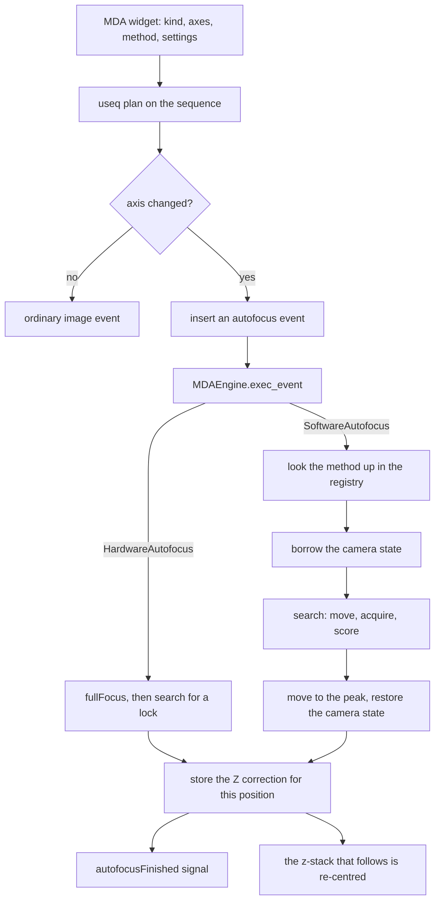

# How autofocus works

Autofocus keeps the sample in focus while an acquisition runs. Focus drifts over
a long time series, a plate is never perfectly flat, and a stage does not return
to a position exactly, so the frames late in a run are the ones that need it
most.

There are two kinds, and an acquisition uses one or the other, never both.

**Hardware autofocus** is a device — a Nikon PFS, a Zeiss Definite Focus —
that reflects light off the coverslip and holds a fixed distance from it. It is
fast, takes no camera images and does not expose the sample. It does not look at
the sample at all, so it holds the *coverslip* in place rather than finding the
sharpest image, and it only locks within a limited range.

**Software autofocus** acquires a short Z series, scores how sharp each image
is, and moves to the peak. It focuses on the sample itself and needs no special
hardware, but every run costs several images, so it takes time and light.

The routines are the ones Micro-Manager's MMStudio offers, so someone who knows
which one suits their sample can keep using it. They are reimplementations
rather than transcriptions; section 9 lists every place the behaviour
deliberately differs from the Java.

None of this code lives in this repository. It is spread across three, and this
document is the map.

| Where | What |
| --- | --- |
| `useq-schema` | The *description*: the action, and the plan that inserts it |
| `pymmcore-plus` | The *implementation*: scores, searches, routines, engine |
| `pymmcore-widgets` | The *controls*: the MDA widget's autofocus section |

## 1. End-to-end flow

The last step is the point of the whole exercise. Autofocus does not simply
move the stage: the engine records how far focus moved at that position and
applies it to the Z positions of every later event there, so a relative Z stack
stays centred on the focus that was just found.

## 2. The schema: when autofocus happens

A sequence carries one `autofocus_plan`. A plan decides *when*
(`should_autofocus`) and *what* (`as_action`):

- `AxesBasedAF` → inserts a `HardwareAutofocus` action
- `SoftwareAxesBasedAF` → inserts a `SoftwareAutofocus` action

Both fire when any of their `axes` changes — `("p",)` meaning "at every stage
position", which is the usual choice — and both support `every_n_timepoints`,
equivalent to MMStudio's "skip frames".

`useq` deliberately does **not** define which software routines exist.
`SoftwareAutofocus` carries a `method` name and a `settings` dict that the
acquisition engine interprets. That keeps the schema free of any one engine's
catalog of algorithms, and means a saved sequence travels with the exact
settings it was run with (MMStudio keeps them in the user profile instead,
where they do not travel with the experiment).

The plan's `event()` also rewrites the Z position of the inserted event to the
*home* position of a relative Z stack, so autofocus runs at the middle of the
stack rather than its first slice.

**Why the plans need a discriminator.** These models ignore unknown fields. A
plain `AxesBasedAF | SoftwareAxesBasedAF` union would happily parse a software
plan as a hardware one and silently drop its `method`, so the union uses a
discriminator that picks the software plan when a `method` is present. Old JSON
with no `method` still reads as a hardware plan.

An absolute Z plan is rejected with either kind: autofocus corrects the focus
position, which an absolute plan would then override.

## 3. Scoring: how sharp is one image?

`score_image(image, method)` returns a number that is larger when the image is
sharper. Only the position of the maximum over a Z sweep matters — the absolute
values are not comparable between methods, cameras or samples.

| Method | What it measures |
| --- | --- |
| `EDGES` | Mean Sobel gradient over mean intensity. A good default. |
| `SHARP_EDGES` | As above, after sharpening: more sensitive, noisier. |
| `MEAN` | Mean intensity. **Not a sharpness measure** (see below). |
| `NORMALIZED_STD_DEV` | Contrast, independent of illumination level. |
| `NORMALIZED_VARIANCE` | As above, weighting strong features more. |
| `REDONDO` | Sum of squared Laplacian responses. |
| `VOLATH`, `VOLATH5` | Autocorrelation along x; `VOLATH5` suppresses noise. |
| `MEDIAN_EDGES` | Diagonal gradients after a median filter: noise-tolerant. |
| `TENENGRAD` | Sum of squared Sobel gradients. |
| `FFT_BANDPASS` | Mean log power in a band of spatial frequencies. |

Two limits worth knowing, both covered by tests:

- **`MEDIAN_EDGES` is blind to detail one pixel across.** The median filter
  removes it along with the noise, so a sample of isolated points scores zero
  however sharp it is. Real sample detail spans several pixels at any usable
  magnification, but this is why it is not the default.
- **`MEAN` only works in brightfield.** It is included because MMStudio offers
  it, and it is genuinely useful there.

The filters underneath (`convolve3x3`, `sobel_magnitude`, `sharpen`,
`median_3x3`) work in `float64` and repeat the edge pixel at the border.

## 4. Searching: where is the peak?

Both searches take a `measure(z) -> score` callable — "move there, acquire,
score" — so they are tested against a synthetic focus curve with no hardware.
The choice is a trade-off in images, which are the expensive part:

- **`brent_search`** narrows a bracket around the peak, taking a parabola
  through its three best points whenever that lands inside the bracket. Fewest
  images, but it needs a single peak within the range, and reports no useful
  curve.
- **`zstack_search`** measures a fixed grid and fits the peak. Costs more
  images, but sees the whole curve and survives noise and local bumps.

`fit_peak` locates the peak *between* samples by fitting a parabola in log
space — equivalently a Gaussian — to the three points around the best sample,
so a scan beats its own step size. It falls back to the best sample whenever
there is nothing to interpolate: a peak at a scan edge, too few points, a flat
curve, or a parabola opening the wrong way.

Both searches stay strictly inside the requested range. That range is a safety
limit on how far the objective may travel, not a hint.

## 5. The routines

| Name | What it does |
| --- | --- |
| `oughtafocus` | Searches a Z range for the sharpest image. |
| `jaf` | A coarse scan, then a fine one. |
| `duo` | Runs two routines in sequence. |

`oughtafocus` is the general one: pick a score and a search, and it walks to the
peak.

`jaf` covers both of MMStudio's JAF plugins. Each pass walks outward from its
start and stops early once the score has fallen well below the best seen, which
saves images on the far side of the peak. The fine pass can use a different
channel — brightfield to find the sample, then fluorescence to focus on it.

`duo` chains two routines, each starting where the last ended: typically a
coarse one over a wide range then a precise one over a narrow range, which
together find focus from further out than either manages alone.

A routine borrows camera state for the run (`capture_state`): a channel that
always has contrast, a short exposure because the images are discarded, a
centred crop so scoring is quick, and optionally the shutter held open. All of
it is restored exactly once on the way out, including when the routine fails
partway — and if *applying* it fails partway, the part already applied is rolled
back.

Autofocus images are acquired through the base `CMMCore.snapImage`, so they do
not reach a live preview or any frame handler. They are diagnostic: scored and
discarded, never saved.

On failure or cancellation a routine puts the focus device back where it found
it. A failed autofocus must not leave the sample somewhere else.

**Adding one.** `register_software_autofocus(name, run, settings_model)` makes a
routine available to sequences and to the GUI, which builds its settings form
from the dataclass.

## 6. The engine

`MDAEngine.exec_event` branches on the action:

- **Resolve.** An unknown method name, or no focus device, is logged and
  skipped rather than raising — an acquisition should carry on. A *misspelled
  setting*, by contrast, raises: that is a mistake in the sequence that will
  never work.
- **Continuous focus.** A locked hardware autofocus would fight the routine for
  the stage, so it is switched off — and left off, because re-engaging would
  pull focus straight back off the position just measured. A routine that drives
  the autofocus device itself opts out with `manages_continuous_focus`.
- **Retries.** `max_retries` attempts, then the result is reported as failed.
- **The Z correction.** On success, `z_after - z_before` is added to that
  position's correction, which `_set_event_z` applies to every later event
  there. Only the drive the Z plan uses is corrected: a routine that moved some
  other stage has already left it where it belongs, and correcting as well would
  double the move.
- **Reporting.** Every attempt of either kind emits `autofocusFinished(event,
  result)`, whether or not focus was found. `AutofocusResult` carries the
  method, the drive, Z before and after, success, a message, and the `(z, score)`
  pairs that make up the focus curve.

Autofocus events are never merged into a hardware-sequenced burst: the
sequencing check only batches image acquisitions.

## 7. Hardware autofocus and the Z search

A hardware autofocus device only locks within a limited range of the coverslip,
so a large move — a new well, a tilted plate, drift — can leave the sample
outside it, and `fullFocus()` simply fails.

`HardwareAutofocus` therefore carries `search_below_um`, `search_above_um` and
`search_step_um`. If autofocus fails where it starts, the engine steps the focus
device down, then up, retrying at each step until it locks, and returns it to
the start if nothing does. This is what MMStudio exposes as a separate
`HardwareFocusExtender` plugin; here it is an option on hardware autofocus
itself, because that is what it is.

The schema defaults are `0`, so nothing starts moving Z on its own; the MDA
widget pre-fills 10 µm either way.

## 8. The GUI

The MDA widget's **Autofocus** card is a checkable group containing:

- the axes that trigger it,
- a **Hardware / Software** mode pair,
- for hardware, the search range,
- for software, the method picker, its **Settings…** dialog, and
  "every N time points".

Only the options belonging to the selected mode are shown. A mode the
microscope cannot run is disabled: hardware needs an autofocus device, software
needs a camera and a focus stage, and an absolute Z plan rules out both. A
disabled mode yields *no plan* — the mode is deliberately never switched for the
user, because a sequence that asks for one kind must not quietly run the other.

The settings dialog is generated from the routine's settings dataclass, so a
routine registered by a user gets a form too. Field types the form cannot edit
are preserved untouched rather than dropped, and only settings that differ from
the routine's defaults are carried, so a routine is free to change its defaults
later.

A software plan naming a routine this installation does not have is kept as-is,
so opening someone else's sequence does not silently change which routine it
uses.

## 9. Departures from Micro-Manager

The algorithms were read from the Java and reimplemented. Everything not listed
here follows it.

- **Floating point throughout.** The Java writes every intermediate result back
  into an 8- or 16-bit image, which rounds it and clips negative values to zero
  — so a gradient kernel keeps only the responses of one sign and discards the
  rest. A focus score is only compared with other scores of the same stack, so
  what matters is where its maximum lies, not its value; keeping the gradient
  information makes the metric better conditioned.
- **The median filter is applied at every pixel depth.** In ImageJ,
  `ShortProcessor.medianFilter()` does nothing at all, so on a 16-bit camera —
  that is, on most scientific cameras — MMStudio's `MedianEdges`, `JAF(H&P)` and
  `JAF(TB)` scores run on the raw, noisy image rather than the denoised one
  their descriptions promise.
- **Borders.** Every filter repeats the edge pixel. The Java is inconsistent:
  its convolutions repeat the edge pixel, while its 8-bit median leaves a border
  of zeros.
- **JAF returns the focus it found.** The Java `fullFocus()` returns `0`
  regardless, and uses a `5000` sentinel and busy-wait delays.
- **JAF(TB) scores the centre.** The Java crops to the centre but discards the
  cropped image, so it filters the whole frame and then sums the *top-left*
  corner.
- **`FFT_BANDPASS` works in float.** The Java quantises the log power spectrum
  to 8 bits first.
- **`duo` is a routine, not a plugin that reaches into a manager.**
- **Exposure defaults to "leave it alone".** MMStudio's OughtaFocus always sets
  one (100 ms by default), which inside an MDA would override the channel's.

## 10. Limits and what is not done

- **`PFSOffsetFocusser` is not ported.** It runs a software autofocus, then
  iterates the PFS *offset* in a closed loop until the Z drive lands back at the
  focus it found, learning the offset-to-Z gearing as it goes. It is the only
  routine whose correctness cannot be established without a real PFS and a
  sample, and the only one that drives a feedback loop on the objective — the
  Java version has no travel limit on that loop. It also needs somewhere to
  persist the learned gearing, which pymmcore-plus has no profile for.
- **No live focus-curve view.** `AutofocusResult.scores` carries the curve and
  `autofocusFinished` delivers it; nothing plots it yet.
- **No "focus now" button.** `run_software_autofocus()` is the entry point for
  one, and is the same path an MDA takes, so the two cannot drift.
- **Autofocus results are not written to the dataset.** The Z each frame was
  acquired at is already in the frame metadata, so the corrected focus is
  recorded; the scores and the method are not.
- **Scores are not comparable across methods.** A number that is good for one
  says nothing about another.

## Source map

In `useq-schema`:

- `src/useq/_actions.py` — `HardwareAutofocus`, `SoftwareAutofocus`
- `src/useq/_autofocus_base.py` — the shared trigger and event construction
- `src/useq/_hardware_autofocus.py`, `src/useq/_software_autofocus.py` — the plans
- `src/useq/_autofocus.py` — the discriminated union of them

In `pymmcore-plus`, under `src/pymmcore_plus/autofocus/`:

- `_filters.py` — `convolve3x3`, `sobel_magnitude`, `sharpen`, `median_3x3`
- `_scoring.py` — `ScoringMethod`, `score_image`, `jaf_score`
- `_fft.py` — the log power spectrum and its frequency band
- `_optimizers.py` — `brent_search`, `zstack_search`, `fit_peak`
- `_capture.py` — borrowing and restoring camera state
- `_settings.py` — the settings dataclass of each routine
- `_routines.py` — `oughtafocus`, `jaf`, `duo`
- `_registry.py` — the name-to-routine catalog and `run_software_autofocus`
- `_result.py` — `AutofocusResult`
- `mda/_engine.py` — `_exec_hardware_autofocus`, `_exec_software_autofocus`
- `mda/events/` — the `autofocusFinished` signal

In `pymmcore-widgets`:

- `src/pymmcore_widgets/useq_widgets/_mda_sequence.py` — the `AutofocusAxis` section
- `src/pymmcore_widgets/useq_widgets/_autofocus_settings.py` — the generated
  settings form
- `src/pymmcore_widgets/mda/_core_mda.py` — which modes the microscope can run

Pixel calibration, a separate routine that also drives the stage, is described
in [PIXEL_CALIBRATION.md](PIXEL_CALIBRATION.md).
