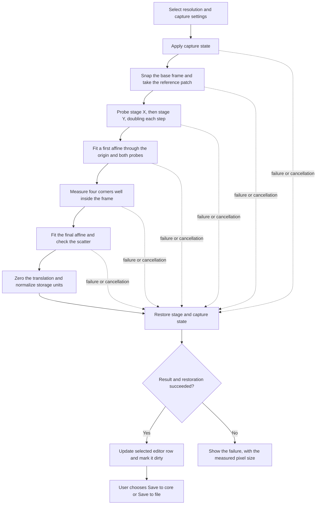

# How pixel calibration works

Automatic pixel calibration measures the relationship between image motion in
pixels and XY-stage motion in micrometres. It estimates a 2 × 2 matrix,
including scale, rotation, and reflection, checks how far the measurements
scatter around it, and makes the result available to the configuration editor.

The measurement is a port of Micro-Manager's Java Pixel Calibrator:
`AutomaticCalibrationThread.java` under
`mmstudio/src/main/java/org/micromanager/internal/pixelcalibrator/`, together
with `ImageUtils.crossCorrelate`,
`MathFunctions.generateAffineTransformFromPointPairs`,
`AffineUtils.affineToMeasurements` and `AffineUtils.deducePixelSize`. It
reports its algorithm version as `v1`.

The port reproduces the Java routine's strategy *and its acceptance criteria*.
There is deliberately no repeat-capture agreement, no drift correction, no
per-image confidence metric and no independent holdout stage: a result that
passes the scatter check is returned for the user to accept or discard, the
way the Java dialog asks. A stricter pipeline with all of those checks used to
live here and was removed, because it rejected measurements that the Java
tolerance accepts on hardware that calibrates correctly. On a 60x objective
with an encoderless stage it reported a holdout RMS of 4.408 px against a
1.568 px limit and refused the result, while the Java calibrator accepted the
same microscope and returned 0.1085 µm/px, which is 6.5/60 to within 0.2%. An
RMS of 4.408 px is inside the 5 px tolerance used here.

The calibration controls live in the modern GUI's **Pixel Configuration** tab;
the numerical pipeline lives in the separate `_pixel_calibration` package.

Bracketed notes mark where this implementation departs from the Java source.
Everything not marked follows it.

## 1. End-to-end flow



The worker runs on a `QThread`. Frame, progress, observation, fit, and
terminal signals update the GUI. Stage and camera operations remain
sequential; image processing does not command hardware concurrently.

`run_pixel_calibration()` is the headless entry point. It manages the stage
and numerical measurement, but does not apply channel or exposure settings or
save a configuration. The GUI wraps it in `CaptureStateTransaction` to manage
temporary capture settings.
[Python only: this explicit headless/transaction separation. Java uses the
core's current capture settings directly.]

## 2. Resolution selection and temporary capture settings

The selected resolution supplies an ID and device/property/value bindings. The
capture form supplies the camera, XY stage, channel, exposure, and light
source intensity.
[Python only: the Java routine uses the core's current camera, stage, and
capture settings rather than this dedicated capture form.]

The GUI deliberately passes an empty `resolution_settings` tuple to the
capture transaction. Selecting a resolution row does not command an objective
turret or other resolution-defining hardware. The hardware must already match
the row's bindings when calibration starts.

The transaction snapshots the properties affected by the selected channel and
light settings, the previous camera, and the calibration camera's exposure. It
selects the camera, applies the channel, reasserts the explicit camera if the
channel changed it, then applies exposure and light properties. Relevant
device or configuration waits follow those changes.

Before measurement, it verifies the expected resolution property values. For
an existing MMCore resolution, it also verifies the current matching
resolution ID. A newly added editor row can therefore be calibrated before its
first save, provided its property bindings match the hardware.

The panel stops its own live preview before starting the worker. Calibration
rejects a running camera sequence or MDA acquisition. While the worker owns the
hardware, the GUI disables capture inputs, resolution edits, configuration
save actions, and the configuration-group tab.

Snap uses the temporary capture transaction and returns a preview frame; it
does not execute calibration or establish that the sample will calibrate.

## 3. Hardware checks and stage motion

The routine requires a selected camera and XY stage, one camera channel, and
images with at least 128 pixels on each spatial axis. Registration accepts
grayscale images or RGB(A) images converted to luminance, using weights
`(0.2126, 0.7152, 0.0722)` with any alpha channel ignored. A multi-channel
camera device is rejected even though an individual RGB image can be
converted.
[Python only: these explicit image-size and camera-channel restrictions. Java
converts colour images through ImageJ's RGB32-to-byte conversion.]

`HardwareFingerprint` records the camera and explicitly selected XY-stage
labels, binning and magnification factor, ROI, image height/width, image
dtype, camera channel count, the current pixel-size configuration ID, and the
expected resolution bindings. Captures check image dimensions against it. The
selected stage is addressed explicitly, so it can differ from the core's
default XY stage.
[Python only: the fingerprint and the resolution-ID and property-binding
checks.]

Each measurement move follows this sequence:

1. Check for cancellation and for a running acquisition.
2. Check that the target is within the safe radius of the starting position
   (see section 7).
3. Call `setXYPosition()` and `waitForDevice()` for the selected stage.
4. Wait the configured settling time, normally 0.1 seconds.
5. Snap one image.

Stage readback supplies the measured displacement: after each corner
measurement the routine reads the actual position, and the fit does not assume
a requested position was reached exactly. Note that on a stage without an
encoder, that readback is normally the driver's own dead-reckoned step count
rather than a measured position, so it cannot reveal backlash or lost steps.
What it does reveal is any difference between what was commanded and what the
driver believes it reached.

## 4. The reference patch

The first snap allows up to three attempts, covering a camera that throws a
transient error before any measurement has happened.
[Python only: Java takes a single base image with no retry. Once measurement
begins, this routine also takes exactly one image per position.]

The reference patch is the central square of the base frame, with side

```text
side = min(pow2(width / 4), pow2(height / 4))
```

where `pow2` is the largest power of two at most its argument. On a 2048 px
camera that is 512 px. The patch minimum is subtracted from it. No window is
applied: Java has an optional Hann window but leaves `useWindow_` false.

A patch below 16 px is rejected as too small to carry usable structure.

## 5. Measuring a displacement

Each measurement crops the same-sized patch from the new frame, offset by the
*predicted* image shift, subtracts that patch's own minimum, and correlates it
against the reference:

```text
moving_patch_start = int((full_size - side) / 2 - expected_shift)
```

The crop is not clipped back inside the frame. A region reaching past the edge
is zero-padded, matching Java's `getSubImage`, which inserts the source into a
blank `FloatProcessor`. This matters for the corner measurements, which sit
close to the frame edge by design.

The correlation is an ordinary, unnormalized Fourier cross-correlation:

```text
correlation = fftshift(ifft2(fft2(reference) * conj(fft2(moving))))
```

This is the same operation as ImageJ's `FHT.conjugateMultiply` followed by an
inverse transform and `swapQuadrants`, so the zero lag sits at the centre.
[Different from Java: NumPy FFT rather than ImageJ's FHT implementation.]

A central box of the correlation is then enlarged tenfold and its maximum
taken, giving a displacement quantized to 0.1 px:

```text
box = min(64, correlation_height, correlation_width)
x = (peak_column - upsampled_width / 2) / 10
```

The enlargement is a separable Catmull-Rom bicubic resample using ImageJ's
centre-aligned source mapping, under which destination index `i` samples
source `i / factor`. That alignment is what makes the `peak - size / 2`
arithmetic return exactly zero for a zero displacement.
[Different from Java: a NumPy Catmull-Rom resample replaces
`ImageProcessor.resize` with `BICUBIC`. The kernel is ImageJ's own `cubic`
with `a = 0.5`.]

[Different from Java: the box is clamped to the correlation size. Java's fixed
64 px box is safe only while the patch is at least 64 px, which holds for any
camera 256 px or larger. Below that the box would be zero-padded, and because
a min-subtracted correlation sits on a large positive pedestal, the bicubic
kernel's negative lobes overshoot at the padding edge and can beat the real
peak.]

The measurement returns `expected_shift + measured_residual`, so a prediction
selects where to look while the returned displacement still comes from the
images. Neither the correlation nor the interpolation repairs a wrong coarse
peak or makes an ambiguous sample identifiable.

## 6. Coordinate conventions

NumPy image arrays use `(row, column)`. Displacements are returned as `(x, y)`
in geometric order, and are the *negative* of the apparent motion of sample
features. The fitted mapping is

```text
stage_delta_um = A @ image_shift_xy

A = [[a00, a01],
     [a10, a11]]
```

The stage and image axes need not point in the same directions. A negative
determinant represents a reflection and is permitted.

## 7. Probing each stage axis

For stage X and then stage Y, the routine moves from the origin along that
axis, doubling both the stage distance and the predicted image shift before
every measurement:

```text
step = 0.1 µm initially; step *= 2 and predicted_shift *= 2 each iteration
```

so the first move is 0.2 µm. It allows at most 25 steps and stops when the
tracked patch approaches a frame edge:

```text
stop when  2 * |shift| + side / 2  reaches  full_size / 2  on either axis
```

Only each probe's final displacement and stage readback are kept. The stored
pixel-size calibration never influences this search.

`safe_radius_um` rejects any target further than that distance from the
starting position, with a message naming the distance needed.
[Different from Java: Java rejects a single move longer than *half* its
configured radius, measured from the current position, which bounds step size
but never bounds how far the stage gets from where it started. Bounding the
excursion from the origin is what protects the objective and specimen, and is
what the GUI's **Safe radius** control promises.]

The origin plus the two probe endpoints give three point pairs, fitted to a
2 × 3 affine that maps image displacement to *absolute* stage position and so
carries a translation term. A degenerate or singular set is rejected.

## 8. The four corner measurements

Corners are placed well inside the frame:

```text
ax = width / 2 - side
ay = height / 2 - side
corners = [(-ax, -ay), (-ax, ay), (ax, ay), (ax, -ay)]
```

Each corner's predicted stage position comes from the first affine, and the
same corner coordinate is the prediction that selects the tracked patch. The
corners are visited in sequence without returning to the origin, so the
longest single move is roughly twice a corner offset.

On a 2048 px camera at 0.1085 µm/px the corners sit about 79 µm from the
origin, so the panel's 100 µm default safe radius is enough there but not at
low magnification.

## 9. Fitting and acceptance

The four pairs are fitted to a 2 × 3 affine by ordinary least squares, the
same system Java solves by QR decomposition. There is no weighting, no robust
reweighting and no outlier removal, so every corner contributes equally.

Acceptance inverse-maps each measured stage position back to pixels and
requires the RMS of those residuals to be within `max_rms_px`, 5.0 px by
default:

```text
residual_px = inverse(A) @ (stage_position - translation) - image_shift
```

Java passes `Double.MAX_VALUE` as its micron-domain tolerance, so only the
pixel domain constrains the result. There is no anisotropy, orthogonality,
condition-number or stored-pixel-size check that can fail a run; implausible
geometry is reported as a warning instead (see section 11).

Because the four corners form a symmetric rectangle, the residual space has a
single degree of freedom per axis: an error on one corner is spread across all
four, and roughly half of it survives as scatter.

The scatter check runs after the result object is built, so a rejected run
still carries its fit. The pixel size it measured is worth showing even though
it is not worth applying, and the corner residuals are what explain the
rejection.

## 10. Pixel size and MMCore storage units

The translation is zeroed and the 2 × 2 linear part kept. From it:

```text
pixel_size_x_um = norm(A[:, 0])
pixel_size_y_um = norm(A[:, 1])
pixel_size_um   = sqrt(abs(det(A)))
rotation_deg    = degrees(atan2(A[1, 0], A[0, 0]))
```

The scalar pixel size is the square root of the pixel's mapped area, not
generally the arithmetic mean of the two axis lengths. `deduce_pixel_size()`
ports `AffineUtils.deducePixelSize`, including its rounding to four decimals.

`affine_to_measurements()` ports `AffineUtils.affineToMeasurements`, returning
the `(x_scale, y_scale, rotation_deg, shear)` that the Java dialog prints and
that the panel now shows on both success and failure. Java decomposes as
`transform = rotation @ scale @ shear` and takes each scale as a column norm;
because the second column also carries the shear, a scale is recovered only to
a relative `1 + shear**2 / 2`.

MMCore stores a raw calibration that accounts for current binning and the
core's magnification factor. `normalize_for_mmcore()` computes:

```text
A_raw = A * magnification / binning
raw_pixel_size_um = sqrt(abs(det(A_raw)))
raw_affine = (A_raw[0, 0], A_raw[0, 1], 0,
              A_raw[1, 0], A_raw[1, 1], 0)
```

[Different from Java: Java divides by camera binning and zeroes the
translation, but does not apply the magnification factor.]

Here `magnification` is `getMagnificationFactor()`, not an objective label
such as "40x". At binning 2 and magnification factor 1, a measured 0.8 µm per
current pixel becomes a stored raw size of 0.4 µm. The result contains both
measured and raw values; the GUI shows the measured size and identifies the
stored raw size separately.

## 11. Warnings

A measured matrix can carry non-fatal warnings: axis-size anisotropy above 2%,
departure from orthogonality above 1°, or a matrix condition number above 2.
These never reject a result.
[Python only: Java presents the affine parameters and asks the user to assess
them.]

## 12. Restoration, cancellation, and diagnostics

After the numerical routine succeeds or fails, its outer wrapper commands the
selected stage back to the saved origin, waits for the device and applies the
settling time. A return landing outside `stage_return_tolerance_um` sets
`stage_returned=False` rather than raising.
[Different from Java: Java commands a return and never checks it. Failing a
measurement because an open-loop stage missed by more than the tolerance would
discard a result that is otherwise correct, so the miss is reported instead.]

Pre-existing cancellation, missing devices, and an already-running acquisition
are rejected before the routine commands the stage. Cancellation during a run
is cooperative: hardware calls and settling sleeps finish before the next
cancellation check. A stage-return failure raises `StageRestoreError` and
retains any preceding calibration failure.

The GUI worker then restores the temporary capture properties, exposure, and
camera, including after failures. Restoration attempts continue across
individual property errors and report collected failures. A capture restore
failure suppresses the success signal even if the measurement and stage
restoration succeeded. Closing the panel requests cancellation and waits for
restoration rather than terminating the worker abruptly.

The diagnostic graph counts observations during acquisition, then becomes a
pixel-residual bar chart once the four-corner affine exists. Its header shows
the exact translation-aware corner RMS beside the run's acceptance limit. Each
corner row gives the residual magnitude and `(dx, dy)` components; green bars
are within the limit and magenta bars exceed it. A dashed line marks the RMS
limit.

The two axis probes remain internal to the first approximation and are not
shown beside the accepted/rejected corner data. Four points fitted to a
six-parameter affine leave only one residual degree of freedom per output
axis. A bad corner is spread across the four fitted residuals, so the corner
bars do not reliably identify which acquisition caused the error.
[Different from Java: Java displays the tracked patch overlay and optionally
the correlation image.]

A quality failure attaches a diagnostic snapshot to `PixelCalibrationError`.
Such a snapshot is not applied automatically; the panel shows its pixel size
labelled "not accepted". The four-corner mismatch
means the measurements were not internally consistent, so the reported pixel
size may be unreliable; the residual is not a statistical uncertainty or
error bar on that scalar value. An explicit **Apply anyway** button lets the
user copy the rejected raw pixel size and affine into the selected resolution
after reviewing the residuals. This uses the normal dirty editor path and does
not write to MMCore or the `.cfg` file until the corresponding save action.
Other failures may have no snapshot. The GUI logs full exceptions and displays
a shorter message.

## 13. Applying and saving the result

A successful calibration updates the selected resolution's editor model with
`raw_pixel_size_um` and the flattened raw affine. The editor verifies that the
selected ID and property bindings still match the result, updates the
displayed values, and marks the page dirty.
[Different from Java: Java asks for confirmation before copying; here a
measured result is applied to the selected editor row automatically.]

This changes the editor only. Persistence is explicit:

- **Save to core** applies the pixel configuration editor to the live MMCore
  instance. The embedded editor suppresses intermediate core events during the
  bulk rewrite and emits an update for the completed configuration.
- **Save to file** asks for a destination, commits the selected configuration
  editor, and saves the full microscope configuration to a `.cfg` file.
  Cancelling the destination dialog leaves those editor changes uncommitted.

There is also a separate `commit_pixel_calibration()` API for programmatic
use. The GUI's normal editor-save path does not call it. It requires a
restored stage, an existing target configuration, and matching optical state.
By default it rejects a raw size change greater than 10%; callers can
explicitly allow that change. It writes size and affine, verifies readback,
and attempts to restore both old values on a partial failure. It does not
write a `.cfg` file.
[Python only: this separate checked commit and rollback helper.]

`PixelCalibrationResult` retains the matrix, diagnostics, fingerprint, corner
observations, the RMS limit, warnings, and algorithm version in memory. The
normal save path does not archive calibration frames or serialize the full
result as a report, and the result does not include a complete snapshot of
`CalibrationOptions`.
Image-acquisition saving is described separately in
[DATA_SAVING.md](DATA_SAVING.md).

## 14. Options

Three settings are editable in the panel:

| Option | Default | GUI label |
|---|---|---|
| `safe_radius_um` | 1000 µm | Safe radius |
| `settle_time_s` | 0.1 s | Settle after move |
| `stage_return_tolerance_um` | 0.5 µm | Return tolerance |

The panel's Safe radius spin box defaults to 100 µm, which suits a high-power
objective; raise it for low magnification, where the corner geometry travels
much further. The remaining numerical options are internal and are all Java's
own values:

| Option | Default | Purpose |
|---|---|---|
| `initial_step_um` | 0.1 | First probe distance in micrometres |
| `max_search_steps` | 25 | Maximum probe distances tried per stage axis |
| `box_size` | 64 | Correlation box cropped before enlargement |
| `upsample_factor` | 10 | Bicubic enlargement of that box |
| `max_rms_px` | 5.0 | Scatter tolerance on the four-corner fit |

Camera, XY stage, channel, exposure, and light controls are separate capture
settings. Option construction rejects non-finite values, non-integer iteration
counts, and invalid ranges.

The completed diagnostic graph consumes `max_rms_px` from the result rather
than reconstructing options, so it displays the limit actually used by that
run.

## 15. Reliability limits and tests

The algorithm contains no randomized fitting or search. Given the same images,
readbacks, and options, it follows the same computation, subject to
floating-point differences. Repeated physical acquisitions still vary because
of camera noise, focus, illumination, stage behaviour, and sample motion.

Sparse or repetitive structure, saturation, strong deformation, insufficient
overlap, and continuing motion can make translation unidentifiable or violate
the single-affine model. Passing synthetic tests does not establish absolute
microscope accuracy: a systematic stage scale error enters the calibration
directly, and with a single image per position there is no repeat measurement
that could expose one.

The maintained tests cover the centre-aligned resample, correlation sign and
axis order, subpixel shifts, the small-patch padding case, zero-padded
cropping, the affine solve and its degenerate rejection, the Java measurement
conversions against a real reported result, binning/magnification
normalization, end-to-end recovery of a synthetic matrix, scatter rejection
and its diagnostics, the safety limit, a stage that misses its return,
transient camera errors, acquisition and cancellation guards, saving
behaviour, and repeatability across five noise seeds at three blur levels.

Run the focused tests from the repository root with the project environment:

```sh
uv run pytest tests/test_pixel_calibration.py \
  tests/test_pixel_configuration_calibration.py
```

The second file includes Qt/viewer tests and needs a working GUI test backend.
The numerical tests use simulated image/stage relationships; running them does
not calibrate the user's physical microscope.

## Source map

Paths below are relative links from this document's `TEMP_MD` directory.

- [Panel and worker](../../widgets/_pixel_calibration_panel.py): capture form,
  preview, thread lifecycle, progress, and diagnostic presentation.
- [Pixel configuration widget](../../widgets/_pixel_configuration.py):
  resolution binding and application of results to the editor.
- [Configuration page](../_configurations.py): save actions and edit locking.
- [Main window](../_main_win.py): configuration file save orchestration.
- [Capture transaction](../../_pixel_calibration/_capture.py): temporary
  camera/channel/exposure/light state and restoration.
- [Calibration routine](../../_pixel_calibration/_routine.py): the ported Java
  calibrator, its correlation and bicubic peak numerics, the
  `AffineUtils` conversions, stage motion, and restoration.
- [Storage units](../../_pixel_calibration/_fit.py): conversion to MMCore raw
  units and the geometric warnings.
- [Models and defaults](../../_pixel_calibration/_models.py): result types,
  options, warnings, fingerprint, and error classes.
- [Programmatic commit](../../_pixel_calibration/_persistence.py): direct
  MMCore write, verification, and rollback helper.
- [Numerical tests](../../../../tests/test_pixel_calibration.py) and
  [GUI tests](../../../../tests/test_pixel_configuration_calibration.py).
