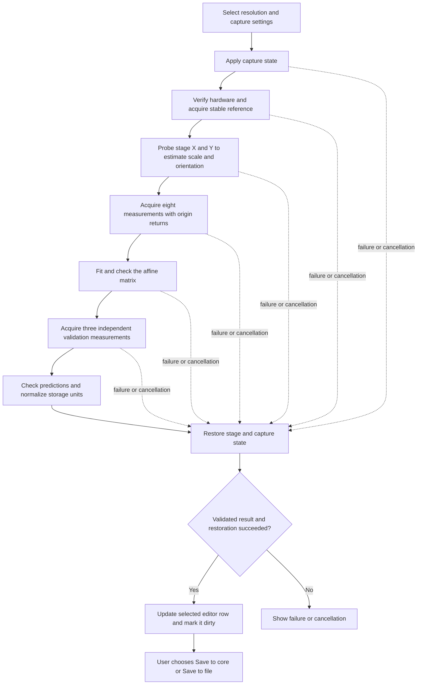

# How pixel calibration works

Automatic pixel calibration measures the relationship between image motion
in pixels and XY-stage motion in micrometres. It estimates a 2 × 2 matrix,
including scale, rotation, and reflection, then checks that matrix against
additional measurements before making it available to the configuration editor.

This document describes algorithm version `1` in the current Python code.
The calibration controls live in the modern GUI's **Pixel Configuration**
tab; the numerical pipeline lives in the separate `_pixel_calibration` package.

Bracketed notes beside the actions compare them with the Java automatic
calibrator, its dialog, and its helpers described in section 16:

- [Same as Java] means the named action or mathematical operation is shared.
- [Partly same as Java] means the strategy is shared, with stated differences.
- [Different from Java] identifies a different implementation or rule.
- [Python only] identifies an addition absent from that Java calibration path.

These labels describe individual actions, not equivalence of the full pipelines
or features elsewhere in Micro-Manager.

## 1. End-to-end flow



The worker runs on a `QThread`. Frame, progress, observation, fit, and terminal
signals update the GUI. The stage and camera operations remain sequential;
image processing does not command hardware concurrently.
[Partly same as Java: Java also uses a background calibration thread and
sequential hardware operations, with Swing updates instead of Qt signals.]

`run_pixel_calibration()` is the headless entry point. It manages the stage
and numerical measurement, but does not apply channel or exposure settings
or save a configuration. The GUI wraps it in `CaptureStateTransaction` to
manage temporary capture settings.
[Python only: this explicit headless/transaction separation.]

## 2. Resolution selection and temporary capture settings

The selected resolution supplies an ID and device/property/value bindings.
The capture form supplies the camera, XY stage, channel, exposure, and light
source intensity.
[Different from Java: the automatic Java routine uses the core's current
camera, stage, and capture settings rather than this dedicated capture form.]

The GUI deliberately passes an empty `resolution_settings` tuple to the
capture transaction. Selecting a resolution row does not command an objective
turret or other resolution-defining hardware. The hardware must already match
the row's bindings when calibration starts.

The transaction snapshots the properties affected by the selected channel and
light settings, the previous camera, and the calibration camera's exposure.
It selects the camera, applies the channel, reasserts the explicit camera if
the channel changed it, then applies exposure and light properties. Relevant
device or configuration waits follow those changes.
[Python only: this temporary capture-state transaction and property snapshot.]

Before measurement, it verifies the expected resolution property values.
For an existing MMCore resolution, it also verifies the current matching
resolution ID. A newly added editor row can therefore be calibrated before
its first save, provided its property bindings match the hardware.
[Python only: these explicit resolution-ID and property-binding checks.]

The panel stops its own live preview before starting the worker. Calibration
rejects a running camera sequence or MDA acquisition. While the worker owns
the hardware, the GUI disables capture inputs, resolution edits, configuration
save actions, and the configuration-group tab.
[Partly same as Java: Java disables its calibration start/radius controls
while running; these acquisition guards and configuration-editor locks differ.]

Snap uses the temporary capture transaction and returns a preview frame; it
does not execute calibration or establish that the sample will calibrate.

## 3. Hardware checks and stage motion

The routine requires a selected camera and XY stage, one camera channel,
and images with at least 128 pixels on each spatial axis. Registration accepts
grayscale images or RGB(A) images converted to luminance. A multi-channel camera
device is rejected even though an individual RGB image can be converted.
[Python only: these explicit image-size and camera-channel restrictions.]

`HardwareFingerprint` records:

- Camera and explicitly selected XY-stage labels.
- Binning and magnification factor.
- ROI, image height/width, image dtype, and camera channel count.
- Current pixel-size configuration ID and the expected resolution bindings.

Before measurement moves, `fingerprint_matches()` checks camera and optical
state against that fingerprint. Captures also check image dimensions and
dtype. The selected stage is addressed explicitly, so it can differ from the
core's default XY stage.
[Python only: the fingerprint and repeated optical-state checks.]

Each measurement move follows this sequence:

1. Check for an acquisition and verify the optical fingerprint.
   [Python only.]
2. Check that the target is within the safe radius of the starting position.
   [Different from Java: Java limits the distance from the current stage
   position to the next target to half its configured safe travel radius.]
3. Call `setXYPosition()` and `waitForDevice()` for the selected stage.
   [Same as Java: command the move, then wait for the stage.]
4. Wait the configured settling time, normally 0.1 seconds.
   [Partly same as Java: Java also waits 100 ms, but the delay is fixed.]
5. Read the actual XY position and check its distance from the origin.
   [Partly same as Java: Java reads positions for measurement pairs; the
   additional origin-radius readback check is specific to Python.]

Stage readback supplies the measured displacement; the fit does not assume
that a requested position was reached exactly. The safe radius is measured
from the origin, not from the preceding target. It constrains target and
readback positions, but cannot certify a hardware trajectory between them.

## 4. Building the reference image

The first snap allows up to three attempts for transient camera errors.
The routine then acquires additional frames until it finds a stable pair,
allowing up to three additional snap attempts with the default options.
Each new frame is compared with previously captured candidates, allowing a
single bad initial frame to be bypassed.
[Different from Java: Java acquires one base image, without this stable-pair
selection or bounded camera retry sequence.]

A reference pair must have matching shape and dtype, pass registration
confidence checks, and differ by no more than 2 pixels in translation norm.
For integer images, more than 10% of samples at either dtype endpoint rejects
the pair. This saturation check uses the dtype's range, not the camera's
reported ADC bit depth.
[Python only: these reference stability, confidence, and saturation checks.]

The second frame is shifted into alignment with the first using a Fourier
shift. Their average becomes the reference. Alignment precedes averaging so
small inter-frame motion does not blur the reference unnecessarily.
[Python only: alignment and averaging of two reference frames.]

The reference is converted to grayscale for registration. RGB conversion uses
weights `(0.2126, 0.7152, 0.0722)`; an alpha channel is ignored.
[Partly same as Java: Java also converts color images to monochrome, using
ImageJ's RGB32-to-byte conversion rather than this float luminance conversion.]

## 5. Registering an image against the reference

`TranslationRegistrar` reuses a prepared reference, its Hann window, and its
Fourier transform throughout the run.
[Partly same as Java: both reuse a reference patch; Java recomputes its
Fourier transform in each `ImageUtils.crossCorrelate()` call.]

### Patch preparation and tracking

The reference patch is the central 75% of image width and height by default.
Patch dimensions are rounded down, with a minimum of 16 pixels per axis.
[Different from Java: Java uses a central square whose power-of-two side is
based on one quarter of the smaller image dimension.]

The [patch-size evaluation](PIXEL_CALIBRATION_PATCH_EVALUATION.md) supports
keeping this default together with the current 12% full-image fitting travel.
At equal travel, the larger patch retained more blurred, sparse, and
peripheral-feature samples in synthetic tests. The 25% and 50% patches were
faster and handled strong uneven illumination better. A 60% follow-up was
slower on some image sizes and less repeatable on peripheral-feature samples.
The larger patch is a reliability tradeoff, not a universally optimal size.
[Different from Java: this evaluates Python with several patch sizes; it does
not benchmark Java's complete calibrator.]

For each patch, preparation:

1. Converts intensities to finite `float32` values.
   [Different from Java: Java extracts into a FloatProcessor, then its
   minimum-subtraction helper converts through unsigned 16-bit images.]
2. Measures the 0.1 and 99.9 intensity percentiles. [Python only.]
3. Rejects an effectively zero intensity span. [Python only.]
4. Clips to that span, subtracts the median, and divides by the span.
   [Different from Java: Java subtracts the patch minimum.]
5. Applies the cached Hann window before the FFT.
   [Different from Java: Java has optional windowing but `useWindow_` is false.]

For moving frames, a predicted image shift determines where to extract the
same-sized patch. [Same as Java: tracking a reference patch near its predicted
location.] In row/column coordinates:

```text
moving_patch_start = clip(round(reference_start - expected_shift),
                          0, full_image_shape - patch_shape)
crop_offset = reference_start - moving_patch_start
```

Clipping keeps the patch inside the acquired image. Registration measures the
remaining displacement between the patches and adds the actual integer crop
offset. The prediction selects the search patch; the returned displacement
still comes from the images.
[Partly same as Java: both add the measured residual to a predicted offset.
Java truncates the crop coordinates and adds the original floating-point
prediction; Python clips the crop and adds its actual integer offset.]

### Correlation and subpixel refinement

The calibration routine explicitly selects ordinary, unnormalized Fourier
cross-correlation. [Same as Java: conjugate multiplication followed by an
inverse Fourier transform; Java uses ImageJ's FHT implementation.]

```text
cross_spectrum = FFT(reference_windowed) * conjugate(FFT(moving_windowed))
correlation = inverse_FFT(cross_spectrum)
```

The maximum correlation magnitude gives an integer displacement. Wrapped FFT
coordinates are converted into signed shifts. A small, locally upsampled DFT
region then refines the peak using matrix multiplication. At the default
upsampling factor of 20, the single-frame search grid is 0.05 pixels. This is
numerical resolution, not a guarantee of physical measurement accuracy.
[Different from Java: Java searches a central 64 × 64 correlation region
after tenfold bicubic enlargement, rather than local DFT refinement.]

Local DFT refinement evaluates the Fourier correlation at fractional shifts
near the coarse peak. Bicubic resizing instead interpolates the already
sampled correlation image. The local DFT method follows
[Guizar-Sicairos, Thurman, and Fienup (2008)][subpixel-paper] and is also used
by [scikit-image's registration implementation][subpixel-skimage]. It retains
the Fourier correlation model while avoiding a fully upsampled correlation
array. At the current factor, Python evaluates a 30 by 30 local region;
Java enlarges its 64 by 64 region to 640 by 640.
[Different from Java: a Fourier-based local refinement replaces bicubic
interpolation. These output sizes alone do not establish relative runtime;
the matrix multiplications also depend on the original patch dimensions.]

The coarse search also differs: Python searches the whole patch correlation,
whereas Java restricts the residual search to the central 64 by 64 region.
A wider search can accommodate larger residual shifts but also expose more
competing peaks. Neither refinement method repairs a wrong coarse peak or
makes an ambiguous sample identifiable. Both are deterministic for fixed
inputs; finer numerical sampling alone does not guarantee better accuracy
or repeatability. The patch-size benchmark does not compare these two
refinement methods, so it establishes no success-rate advantage over Java.
[Different from Java: residual search range as well as peak interpolation.]

[subpixel-paper]: https://doi.org/10.1364/OL.33.000156
[subpixel-skimage]: https://scikit-image.org/docs/stable/api/skimage.registration.html

The standalone `register_translation()` helper and the registrar constructor
still default to phase normalization. Both reference-pair registration and
the automatic calibration registrar explicitly request `"unnormalized"`.

### Confidence and alignment error

[Python only: Java's displacement estimator returns a peak displacement
without these per-image confidence metrics or alignment-error checks.]

Every registration reports:

| Metric | Meaning | Default requirement |
|---|---|---|
| PSR | Peak prominence over sidelobe mean and spread | At least 8 |
| Peak ratio | Peak divided by largest retained sidelobe | At least 1.05 |
| Overlap | Estimated overlap of the two tracked patches | At least 0.60 |
| Normalized error | Residual intensity mismatch after alignment | At most 0.75 |

The shift must also be finite. For PSR and peak ratio, the main correlation
lobe is excluded from the sidelobes. The exclusion radius expands using the
first half-height crossings along both axes, so a broad peak's shoulder is
not automatically classified as a competing peak.

Overlap is computed from the residual patch displacement, before adding the
integer crop offset. It describes patch overlap, rather than the fraction of
the original full camera frames that overlaps.

Alignment error is evaluated on unwindowed, normalized patches. The moving
patch is Fourier-shifted into alignment, and borders are excluded by
`ceil(abs(residual_shift)) + 2` pixels on each side of each axis. Insufficient
remaining area produces infinite error.

The valid patches are mean-centered. A nonnegative least-squares gain removes
remaining brightness-scale differences, using scalar sums rather than an
image-sized design matrix. The residual norm is divided by the reference's
centered norm. Constraining gain to be nonnegative prevents an inverted image
from receiving a good score merely by fitting a negative brightness gain.

## 6. Repeatable captures and bounded retries

[Python only: Java takes one image per requested displacement and has no
equivalent two-capture agreement check or bounded retry consensus.]

A displacement measurement normally needs two independently captured frames
registered against the shared reference. Up to three capture/registration
attempts are allowed at each position.

Only registrations meeting the confidence requirements enter the candidate
set. After each usable frame, the routine finds the closest pair of shifts.
Their Euclidean distance must be at most 0.75 pixels. If a pair agrees, the
routine returns immediately with:

- The mean shift of the two selected registrations.
- The lower PSR, peak ratio, and overlap of the pair.
- The higher alignment error of the pair.
- The mean estimated capture time of the pair.

Each capture time is estimated from the midpoint of the host's monotonic
clock readings around the snap/image-copy operation. It is not a hardware
exposure timestamp.

If no pair agrees, the routine either raises the acquisition/registration
error or returns its best diagnostic candidate with infinite error, making
that candidate unusable. A low-confidence target may be excluded from the
fit. An unusable probe or origin return stops calibration. Acquisition starts
and camera-format changes abort directly rather than consuming normal retries.

## 7. Adaptive X/Y probing and the initial matrix

The initial probe distance is always 0.5 µm with the defaults. The stored
pixel-size calibration does not influence this search.
[Partly same as Java: Java also probes independently of the stored pixel size,
but starts from 0.1 µm and doubles before moving, making its first move 0.2 µm.]

For stage X and then stage Y, the routine moves from the origin along the
positive stage axis, measures repeatable image displacement, and returns to
the origin. A usable displacement must satisfy:

```text
norm(shift_xy) >= max(8 px, 0.04 * min(image_width, image_height))
max(abs(shift_x) / image_width, abs(shift_y) / image_height) <= 0.30
```

When a reliable displacement is too small, both stage distance and predicted
image displacement double for the next probe. The search allows 16 steps per
axis, stays within the safe radius, and fails if registration is unreliable
or image displacement exceeds the allowed fraction. It does not repeatedly
increase travel after losing the image match.
[Partly same as Java: both double stage distance and predicted image shift.
Java allows 25 steps and continues until the predicted patch reaches an image
boundary. Python's displacement thresholds and return after every probe differ.]

The two accepted image/stage displacement pairs determine an initial 2 × 2
matrix. This two-point fit skips robust outlier rejection because there is
no redundant observation. A singular or poorly conditioned image-shift design
is rejected.
[Partly same as Java: both derive an initial transform from X/Y probes.
Java fits the origin plus two probe points with a translation term; Python
fits two displacement pairs without that term.]

## 8. Coordinate conventions and measurement targets

NumPy image arrays use `(row, column)`. Registration returns `(x, y)` in
geometric order: the shift applied to the moving image to align it with the
reference. This is opposite the apparent motion of sample features.
[Same as Java: geometric x/y image displacement maps to stage motion.]

The fitted mapping is:

```text
stage_delta_um = A @ corrected_image_shift_xy

A = [[a00, a01],
     [a10, a11]]
```

All inputs are displacements relative to an origin, so this model fits no
translation term. The stage and image axes need not point in the same
directions. A negative determinant represents a reflection and is permitted.
[Partly same as Java: Java permits reflection, but fits absolute stage
positions with a translation term that its dialog later sets to zero.]

Let `Wc = image_width * crop_fraction` and similarly define `Hc`. The eight
fitting targets are generated in image coordinates with:

```text
x = 0.16 * Wc
y = 0.16 * Hc
targets = [(x, 0), (-x, 0), (0, y), (0, -y),
           (x, y), (-x, -y), (-x, y), (x, -y)]
stage_offsets = [A_initial @ target for target in targets]
```

Thus the default axial targets are 12% of full image width or height.
If the largest stage offset exceeds the safe radius, every offset in that
target set is scaled together so the largest becomes 90% of the radius.

The routine acquires all eight target observations and needs at least six
usable observations before fitting. Probe observations are used only for the
initial estimate; they are not included in the final fit.
[Different from Java: Java acquires four corners for the final fit, using
pixel offsets based on half the image size minus the patch side. Python's
eight-target geometry, common radius scaling, and six-point minimum differ.]

## 9. Origin returns and drift correction

[Python only: Java's final corner measurements are not bracketed by origin
captures and have no equivalent time-interpolated drift correction.]

After probing, the routine acquires a validated origin registration. Each
subsequent fitting or validation observation consists of a target move and
capture, followed by an origin return and capture. The preceding origin
registration is reused as the observation's starting reference measurement.

This brackets each target with origin measurements. With estimated capture
times `t_before`, `t_target`, and `t_after`:

```text
f = clip((t_target - t_before) / (t_after - t_before), 0, 1)
drift = (1 - f) * origin_shift_before + f * origin_shift_after
corrected_shift = target_shift - drift
local_origin = (1 - f) * origin_position_before + f * origin_position_after
stage_delta = actual_target_position - local_origin
```

The interpolation uses `f = 0.5` if timestamps are unavailable or not ordered.
Normal captures supply timestamps, allowing asymmetric retry and acquisition
times to be accounted for. Stage readback and image shifts use the same
interpolation fraction.

This corrects approximately linear drift and origin-position variation over
the bracket. It cannot remove arbitrary sample deformation, nonlinear drift,
or motion during an individual exposure. A failed origin registration is
never carried forward as a valid drift estimate.

## 10. Robust affine fitting

For the accepted observations, `fit_affine()` solves weighted least squares
using `numpy.linalg.lstsq`. The image-shift design must span two dimensions
and have condition number at most 100.
[Partly same as Java: both solve a least-squares image-to-stage transform.
Java uses unweighted QR decomposition with a translation term; Python adds
confidence weights, the condition-number check, and robust refinement.]

Initial confidence weights are the observation PSRs divided by their median,
clipped to `[0.25, 2.0]`, then normalized inside the fit. Caller-owned weights
are copied before normalization.

For the final fit, up to 20 iteratively reweighted least-squares steps apply
Huber weights to the norms of residual vectors in stage units:

[Python only: Huber reweighting and explicit outlier removal.]

```text
scale = max(1.4826 * median(residual_norms_um), machine_epsilon)
cutoff = 1.345 * scale
robust_weight = min(1, cutoff / residual_norm_um)
weight = base_confidence_weight * robust_weight
```

Zero residuals retain weight 1. Iteration ends early when the matrix converges
under the implementation's `allclose` tolerances. An observation is an inlier
when its final weight is at least 25% of its base weight. Up to two outliers
may be removed, followed by a fit using the remaining base confidence weights.
At least six inliers must remain; a singular matrix also rejects the result.

Residual vectors are converted back to image pixels with the inverse matrix.
Reported fitting RMS and worst residual evaluate only the retained inliers.
The result also carries residual arrays, weights, and the inlier mask.

## 11. Fit acceptance and independent validation

[Partly same as Java: Java checks the fitted corner points against a 5-pixel
RMS tolerance. Python uses the following scale-dependent RMS and point limits
and adds geometric checks.]

For a group of observations, let `L` be the median norm of its corrected
image shifts. Default limits are:

```text
preferred_RMS_limit_px = max(0.5, 0.01 * L)
hard_point_limit_px = max(1.5, 0.03 * L)
```

The fitting stage rejects a result if its inlier RMS exceeds the RMS limit
or its worst inlier exceeds the point limit. `L` is computed from the
registration-accepted fitting observations, before robust outlier removal.
More than 10% axis-size anisotropy or more than 5° departure from orthogonality
also rejects the fit.

Three additional target positions are then generated using the fitted matrix.
[Python only: independent holdouts that are not used to fit the matrix.]

```text
q = 0.65 * target_shift_fraction
holdouts = [(0.87 * Wc * q, 0.50 * Hc * q),
            (-0.87 * Wc * q, 0.50 * Hc * q),
            (0, -Hc * q)]
```

These use the same radius scaling, repeat captures, and drift correction.
They do not enter a refit. All three must have usable registrations.
Prediction error is measured in pixels:

```text
error_vector_px = inverse(A) @ (stage_delta - A @ corrected_shift)
```

Validation recalculates the limits using the holdouts' own median shift norm.
A worst prediction above the hard point limit fails calibration. An RMS above
the preferred limit produces the warning `holdout_rms_above_preferred` if
every prediction remains within the hard point limit. A successful result can
therefore carry an independent-validation warning.

Other warnings identify axis-size anisotropy above 2%, departure from
orthogonality above 1°, matrix condition number above 2, or a measured pixel
size differing from the current positive calibration by more than 5%.
That existing-calibration comparison does not influence the measured matrix.
[Python only: this set of automatic warnings. Java instead presents affine
parameters and asks the user to assess and accept the result.]

## 12. Pixel size and MMCore storage units

From the matrix measured in current-image units:

```text
pixel_size_x_um = norm(A[:, 0])
pixel_size_y_um = norm(A[:, 1])
pixel_size_um = sqrt(abs(det(A)))
anisotropy = abs(pixel_size_x_um - pixel_size_y_um)
             / ((pixel_size_x_um + pixel_size_y_um) / 2)
rotation_deg = degrees(atan2(A[1, 0], A[0, 0]))
```

The scalar pixel size is the square root of the pixel's mapped area. It is
not generally the arithmetic mean of the two axis lengths.
[Same as Java: `sqrt(abs(det(A)))` is also used by `AffineUtils.deducePixelSize()`.
Java additionally rounds that scalar to four decimal places.]

MMCore stores a raw calibration that accounts for current binning and the
core's magnification factor when used. `normalize_for_mmcore()` computes:

```text
A_raw = A * magnification / binning
raw_pixel_size_um = sqrt(abs(det(A_raw)))
raw_affine = (A_raw[0, 0], A_raw[0, 1], 0,
              A_raw[1, 0], A_raw[1, 1], 0)
```

[Partly same as Java: Java also divides by camera binning and zeroes the
translation before offering the result. Its automatic calibration thread
does not apply Python's explicit magnification-factor multiplication.]

Here `magnification` is `getMagnificationFactor()`, not an objective label
such as "40x". For example, at binning 2 and magnification factor 1, a
measured 0.8 µm/current pixel becomes a stored raw size of 0.4 µm.

The result contains both measured and raw values. The GUI shows the measured
size and identifies the stored raw size separately.

## 13. Restoration, cancellation, and diagnostics

After the numerical routine succeeds, fails, or observes cancellation, its
outer wrapper attempts to return the selected stage to the saved origin.
It waits for the device, applies settling time, and checks readback against
`stage_return_tolerance_um`, normally 0.5 µm. Only a successful return sets
`stage_returned=True` on a successful result.
[Partly same as Java: Java commands a return after success and in its
calibration-failure exception, but does not perform this return-tolerance check.]

Pre-existing cancellation, missing devices, and an already-running acquisition
are rejected before the headless routine commands the stage. Cancellation
during a run is cooperative: hardware calls and settling sleeps finish before
the next cancellation check. A stage-return failure raises `StageRestoreError`
and retains the preceding calibration failure when one exists.
[Different from Java: Java interrupts its thread and handles interruption
with UI cleanup; that catch path does not explicitly return the stage.
Python routes cancellation through its restoration wrapper.]

The GUI worker then restores the temporary capture properties, exposure, and
camera, including after calibration failures. Restoration attempts continue
across individual property errors and report collected failures. A capture
restore failure suppresses the success signal even if numerical validation
and stage restoration succeeded. Closing the panel requests cancellation and
waits for restoration rather than terminating the worker abruptly.
[Python only: restoration of the explicit capture transaction and suppression
of success when that restoration fails.]

The diagnostic graph receives observations during acquisition and the fitted
matrix before holdout validation. Blue points represent measured relative
stage positions; prediction rings show the mapped image shifts. Green rings
meet the preferred error limit; magenta rings do not. These colors describe
the preferred threshold, so a magenta holdout does not necessarily exceed
the hard failure limit.
[Different from Java: Java displays the tracked patch overlay and optionally
the correlation image, rather than this observation/prediction graph.]

Fit and holdout quality failures can attach a diagnostic snapshot to
`PixelCalibrationError`. Such snapshots are for inspection and are not valid
results to apply. Other failures may have no snapshot. The GUI logs full
exceptions and displays a shorter message to the user.

## 14. Applying and saving the result

Successful calibration updates the selected resolution's editor model with
`raw_pixel_size_um` and the flattened raw affine. The editor verifies that
the selected ID and property bindings still match the result, updates the
displayed values, and marks the page dirty.
[Partly same as Java: both copy calibration values into the configuration
editor. Java asks for confirmation before copying; Python applies a validated
result automatically to the selected editor row.]

This automatic application changes the editor only. Persistence is explicit:

- **Save to core** applies the pixel configuration editor to the live MMCore
  instance. The embedded editor suppresses intermediate core events during
  the bulk rewrite and emits an update for the completed configuration.
- **Save to file** asks for a destination, commits the selected configuration
  editor, and saves the full microscope configuration to a `.cfg` file.
  Cancelling the destination dialog leaves those editor changes uncommitted.

[Same as Java: completing the calibration does not itself write a `.cfg` file;
the calibration dialog passes values to the configuration editor.]

There is also a separate `commit_pixel_calibration()` API for programmatic
use. The GUI's normal editor-save path does not call this helper. It requires
a restored stage, an existing target configuration, and matching optical
state. By default it rejects a raw size change greater than 10%; callers can
explicitly allow that change. It writes size and affine, verifies readback,
and attempts to restore both old values on a partial failure. It does not
write a `.cfg` file.
[Python only: this separate checked commit and rollback helper.]

`PixelCalibrationResult` retains the matrix, diagnostics, fingerprint,
observations, warnings, and algorithm version in memory. The normal save path
does not archive calibration frames or serialize this full result as a report.
The result currently does not include a snapshot of `CalibrationOptions`.
Image-acquisition saving is described separately in [DATA_SAVING.md](DATA_SAVING.md).

## 15. Options exposed by the GUI

[Different from Java: the Java dialog exposes safe travel radius and debug
mode, while its 100 ms settling delay is fixed. Python exposes the three
motion settings below; the numerical options remain internal.]

Only these `CalibrationOptions` are editable in the current panel:

| Option | Default | GUI label |
|---|---|---|
| `safe_radius_um` | 100 µm | Safe radius |
| `settle_time_s` | 0.1 s | Settle after move |
| `stage_return_tolerance_um` | 0.5 µm | Return tolerance |

Camera, XY stage, channel, exposure, and light controls are separate capture
settings. There is no advanced mode for the numerical options. Their current
defaults are:

| Option | Default | Purpose |
|---|---|---|
| `crop_fraction` | 0.75 | Reference patch fraction on each image axis |
| `upsample_factor` | 20 | Subpixel DFT search resolution |
| `min_psr` | 8.0 | Minimum correlation peak prominence |
| `min_peak_ratio` | 1.05 | Minimum peak-to-sidelobe ratio |
| `min_overlap` | 0.60 | Minimum tracked-patch overlap |
| `max_registration_error` | 0.75 | Maximum normalized alignment error |
| `target_shift_fraction` | 0.16 | Fitting target fraction of cropped axes |
| `min_shift_fraction` | 0.04 | Minimum probe shift relative to image size |
| `max_shift_fraction` | 0.30 | Maximum probe shift on either image axis |
| `min_shift_px` | 8.0 | Absolute lower bound for useful probe motion |
| `max_probe_steps` | 16 | Maximum probe distances tried per stage axis |
| `initial_probe_um` | 0.5 | First probe distance in micrometres |
| `max_registration_attempts` | 3 | Bounded capture/registration attempts |
| `registration_consistency_px` | 0.75 | Maximum disagreement within a pair |
| `max_fit_rms_px` | 0.5 | Absolute RMS limit in pixels |
| `max_fit_fraction` | 0.01 | RMS limit relative to median image shift |
| `max_point_residual_px` | 1.5 | Absolute point-error limit in pixels |
| `max_point_residual_fraction` | 0.03 | Relative point-error limit |

Option construction rejects non-finite values, non-integer iteration counts,
and invalid ranges or ordering. Some checks are implementation constants,
including reference stability, saturation, minimum inliers, and geometric
anisotropy/orthogonality limits.

If numerical thresholds are exposed in the future, the graph must consume
the options used by the run. It currently creates default `CalibrationOptions`
when classifying prediction accuracy. Recording run options with the result
would also be necessary for reproducible comparisons of customized runs.

## 16. Relationship to Java Micro-Manager

The reference implementation is `AutomaticCalibrationThread.java` under
`mmstudio/src/main/java/org/micromanager/internal/pixelcalibrator/` in the
Micro-Manager repository. Its strategy is progressive stage probing,
reference-patch tracking near a predicted location, Fourier cross-correlation,
and a second affine estimate from spatially separated measurements.

The bracketed comparisons also use `PixelCalibratorDialog.java` for result
acceptance and cancellation, `ImageUtils.java` for image conversion and
correlation, `MathFunctions.java` for affine fitting, and `AffineUtils.java`
for the scalar pixel-size calculation.

Python follows that strategy with deliberate implementation differences:

- Java uses a small square patch with a power-of-two side based on one quarter
  of the image dimensions. Python uses a larger rectangular fractional patch.
- Java disables its optional analysis window. Python applies a Hann window
  after percentile normalization.
- Java searches a central 64 × 64 correlation region, enlarged tenfold with
  bicubic interpolation. Python locates the patch correlation peak and refines
  a local DFT region at 20-fold resolution by default.
- Java's final estimate fits four corners with an affine translation term
  and a 5-pixel RMS tolerance. Python fits eight origin-relative observations
  robustly, with up to two exclusions and three independent holdouts.
- Python adds repeated-capture agreement, explicit image confidence checks,
  time-based drift correction, and verified stage/capture restoration.

These are shared measurement principles, rather than identical numerical
outputs or identical acceptance criteria.

## 17. Reliability limits and tests

The algorithm contains no randomized fitting or search. Given the same images,
readbacks, timing, and options, it follows the same computation, subject to
floating-point implementation differences. Repeated physical acquisitions
still vary because of camera noise, focus, illumination, stage behavior,
and sample motion. Samples near an acceptance threshold can cross it between
runs; repeated captures reduce this risk without guaranteeing success.

Sparse or repetitive structure, saturation, strong deformation, insufficient
overlap, and continuing motion can make translation unidentifiable or violate
the single-affine model. The routine rejects such measurements when its checks
detect them. Passing synthetic tests does not establish absolute microscope
accuracy; systematic stage scale error, for example, enters the calibration.

The maintained tests cover registration sign and axis order, subpixel shifts,
gain/offset changes, RGB conversion, inaccurate patch predictions, periodic
or unrelated images, affine outliers, binning/magnification normalization,
transient failures, drift timing, state restoration, and saving behavior.
The repeatability test uses five noise seeds at each of three blur levels,
with camera crops from a larger field and different stored pixel-size hints.

Run the focused tests from the repository root with the project environment:

```sh
uv run pytest tests/test_pixel_calibration.py \
  tests/test_pixel_configuration_calibration.py
```

The second file includes Qt/viewer tests and needs a working GUI test backend.
The numerical tests use simulated image/stage relationships; running them
does not calibrate the user's physical microscope.

## Source map

Paths below are relative links from this document's `TEMP_MD` directory.

- [Panel and worker](../../widgets/_pixel_calibration_panel.py): capture form,
  preview, thread lifecycle, progress, and diagnostic presentation.
- [Pixel configuration widget](../../widgets/_pixel_configuration.py):
  resolution binding and application of results to the editor.
- [Configuration page](../_configurations.py): save actions and edit locking.
- [Main window](../_main_win.py): configuration file save orchestration.
- [Capture transaction](../../_pixel_calibration/_capture.py): temporary
  camera/channel/exposure/light state and restoration.
- [Calibration routine](../../_pixel_calibration/_routine.py): stage motion,
  reference selection, retries, probing, observations, and validation.
- [Image registration](../../_pixel_calibration/_registration.py): patch
  preparation, correlation, subpixel refinement, and confidence metrics.
- [Affine fitting](../../_pixel_calibration/_fit.py): robust solve,
  geometric diagnostics, and conversion to MMCore storage units.
- [Models and defaults](../../_pixel_calibration/_models.py): result types,
  options, warnings, fingerprint, and error classes.
- [Programmatic commit](../../_pixel_calibration/_persistence.py): direct
  MMCore write, verification, and rollback helper.
- [Numerical tests](../../../../tests/test_pixel_calibration.py) and
  [GUI tests](../../../../tests/test_pixel_configuration_calibration.py).
